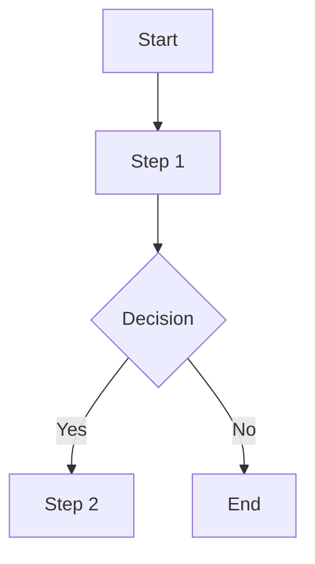

## Description

Please include a summary of the changes and the related issue. Please also include relevant motivation and context. List any dependencies that are required for this change.

- **Issue Number:** (e.g. #123)

## Type of change

Please delete options that are not relevant.

- [ ] Bug fix
- [ ] New feature
- [ ] Performance improvement
- [ ] Documentation update
- [ ] Github Actions CI change

## How Has This Been Tested?

Please describe the tests that you ran to verify your changes. Provide instructions so that reviewers can reproduce your tests. List any relevant details for your test configuration.

- **Test A:** (e.g. Ran unit tests)
- **Test B:** (e.g. Tested in staging environment)

## Checklist:

Please delete options that are not relevant.

- [ ] My code follows the style guidelines of this project
- [ ] I have performed a self-review of my own code
- [ ] I have commented my code, particularly in hard-to-understand areas
- [ ] I have made corresponding changes to the documentation
- [ ] My changes generate no new warnings
- [ ] I have added tests that prove my fix is effective or that my feature works
- [ ] New and existing unit tests pass locally with my changes
- [ ] Any dependent changes have been merged and published in downstream modules

## Example Diagram (if applicable):

Below is an example of a Mermaid diagram. Update it to reflect any relevant flows, sequences, or architectures related to your PR. or delete if it is not relevant.

## Screenshots (if applicable):

Add any screenshots that might help illustrate your changes.

## Additional Context (optional):

Add any other context or information about the pull request here.
