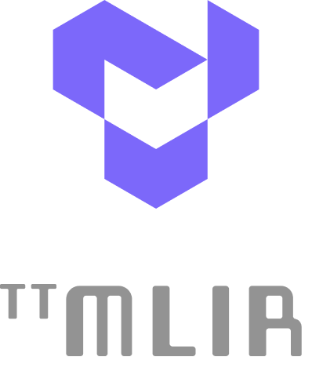

[![Tests][tests badge]][tests]
[![Codecov][codecov badge]][codecov]

<h1>

[Hardware](https://tenstorrent.com/cards/) | [Documentation](https://docs.tenstorrent.com/tt-mlir/) | [Discord](https://discord.gg/tenstorrent) | [Join Us](https://boards.greenhouse.io/tenstorrent?gh_src=22e462047us) | [Bounty $](https://github.com/tenstorrent/tt-mlir/issues?q=is%3Aissue%20state%3Aopen%20label%3Abounty)

</h1>

 

tt-mlir is a compiler project aimed at defining MLIR dialects to abstract compute on Tenstorrent AI accelerators.
It is built on top of the [MLIR](https://mlir.llvm.org/) compiler infrastructure and targets [TTNN](https://github.com/tenstorrent/tt-metal).

For more information on the project, see https://tenstorrent.github.io/tt-mlir/.

 

-----
# Quick Links
- [Getting Started](https://docs.tenstorrent.com/tt-mlir/getting-started.html)
- [Tools](https://tenstorrent.github.io/tt-mlir/tools.html)
- [Additional Reading](https://tenstorrent.github.io/tt-mlir/additional-reading.html)

-----
# What is this Repo?

tt-mlir is an open-source compiler framework that is used to compile and optimize machine learning models for Tenstorrent's custom AI hardware, such as Wormhole and Blackhole. Built on top of LLVM’s MLIR, it defines custom dialects and transformation passes tailored for Tenstorrent's architectures. It enables efficient translation of models from front-end dialects, such as StableHLO, into binaries optimized for Tenstorrent accelerators.

-----
# Project Goals

- **Generality**: Support a wide range of AI models and workloads including training
- **Scalable**: First class primitives to describe scaling to multichip systems
- **Performant**: Enable great out of the box performance
- **Tooling**: Enable human in the loop guided compiler optimization
- **Open Source**: All project development is done in the open

[codecov]: https://codecov.io/gh/tenstorrent/tt-mlir
[tests]: https://github.com/tenstorrent/tt-mlir/actions/workflows/on-push.yml?query=branch%3Amain
[codecov badge]: https://codecov.io/gh/tenstorrent/tt-mlir/graph/badge.svg
[tests badge]: https://github.com/tenstorrent/tt-mlir/actions/workflows/on-push.yml/badge.svg?query=branch%3Amain

-----
# Related Tenstorrent Projects
- [tt-forge-fe](https://github.com/tenstorrent/tt-forge-fe)
- [tt-xla](https://github.com/tenstorrent/tt-xla)
- [tt-forge](https://github.com/tenstorrent/tt-forge)
- [tt-metalium](https://github.com/tenstorrent/tt-metal)
- [tt-tvm](https://github.com/tenstorrent/tt-tvm)
- [tt-torch](https://github.com/tenstorrent/tt-torch) - (deprecated)

-----
# Tenstorrent Bounty Program Terms and Conditions

This repo is a part of Tenstorrent’s bounty program. If you are interested in helping to improve tt-forge, please make sure to read the [Tenstorrent Bounty Program Terms and Conditions](https://docs.tenstorrent.com/bounty_terms.html) before heading to the issues tab. Look for the issues that are tagged with both “bounty” and difficulty level!
