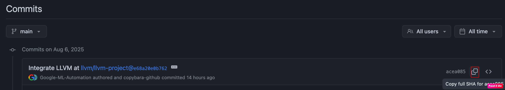
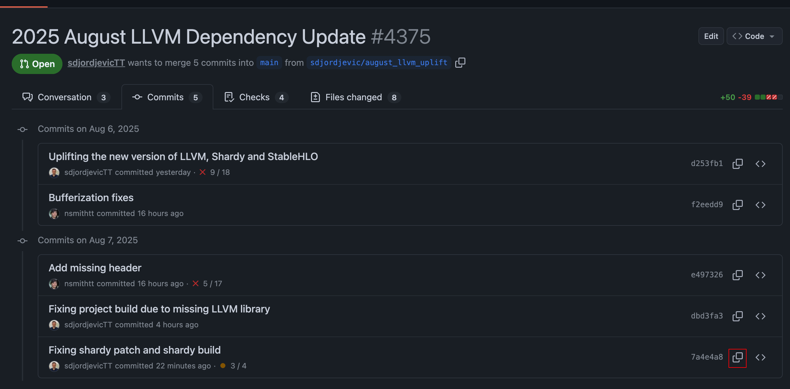
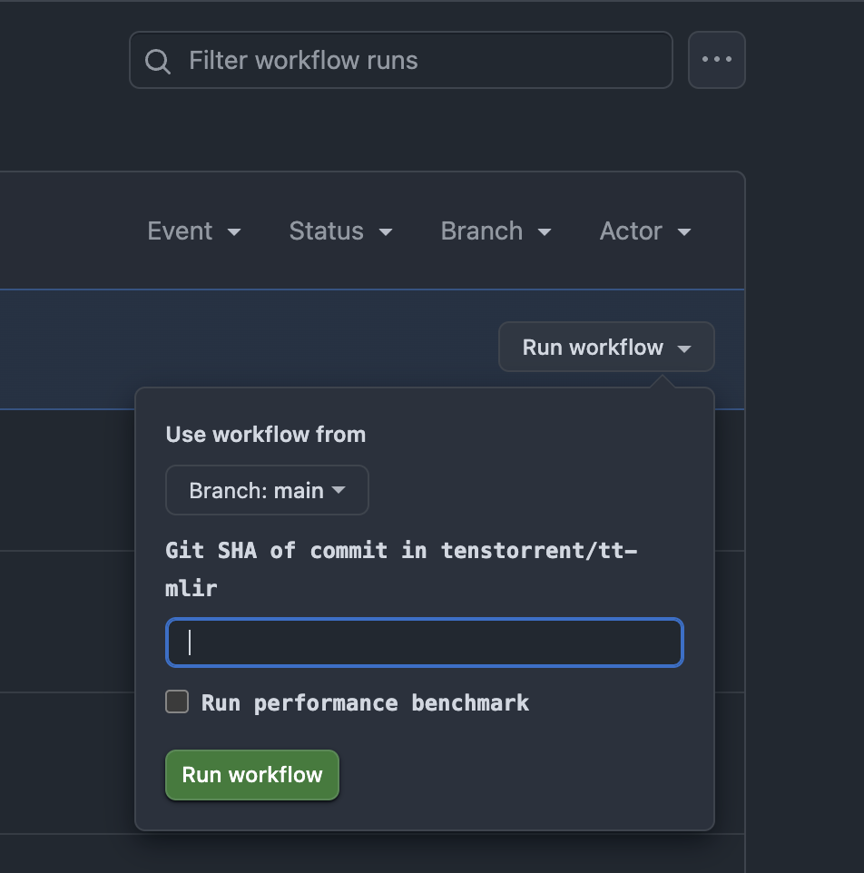

# LLVM Dependency Update

The TT-MLIR compiler has the following LLVM-related dependencies:

## Dependency Hierarchy

- **LLVM** - Core LLVM infrastructure
- **StableHLO** - High-level operations dialect
  - Depends on LLVM as an external dependency
- **Shardy** - Sharding and partitioning dialect
  - Depends on StableHLO as an external dependency

## Dependency Management

These projects are actively developed upstream, and our compiler code needs to occasionally update these dependencies to:

- Incorporate new features and optimizations
- Apply security patches and bug fixes
- Maintain compatibility with the broader LLVM ecosystem

## Updating Cadence

We should update our compiler LLVM dependencies at least once every three months. The schedule for the next updates should be around:
- November 2025
- February 2026
- May 2026

## Updating Dependencies

1. Identify compatible versions across the dependency chain:
  - Select the latest Shardy version from the [main branch](https://github.com/openxla/shardy/commits/main/) and record it as SHARDY_COMMIT
  
  - On this commit of Shardy, we can obtain the used version of [StableHLO](https://github.com/openxla/shardy/blob/main/third_party/stablehlo/workspace.bzl):
    - `STABLEHLO_COMMIT = "..."`
  - On this commit of StableHLO, we can obtain the used version of [LLVM](https://github.com/openxla/stablehlo/blob/99b0925e064b24c3623bf6fdb20de70732ffe81e/WORKSPACE.bazel):
    - `LLVM_COMMIT = "..."`

2. Prepare the development environment using the base tt-mlir IRD Ubuntu image. This clean Docker image lacks prebuilt dependencies, enabling fresh builds for dependency updates and troubleshooting:
```
ghcr.io/tenstorrent/tt-mlir/tt-mlir-base-ird-ubuntu-24-04:latest
```

3. Synchronize with the latest tt-mlir main branch:
```bash
git pull
```

4. Create uplift branch in the following format:
  ```bash
  git checkout -b [alias]/[year]_[month]_llvm_dependency_update
  # For example: sdjordjevic/2025_august_llvm_dependency_update
  ```

5. Update dependency versions in the [CMakeLists.txt configuration](https://github.com/tenstorrent/tt-mlir/blob/main/env/CMakeLists.txt):
  - LLVM_PROJECT_VERSION with LLVM_COMMIT obtained from step 1
  - STABLEHLO_VERSION with STABLEHLO_COMMIT obtained from step 1
  - SHARDY_VERSION with SHARDY_COMMIT obtained from step 1

6. Build the local environment following [this section of doc](getting-started.md#setting-up-the-environment-manually):
  ```
  cmake -B env/build env
  cmake --build env/build
  ```

7. Build the tt-mlir compiler with runtime, optimizer and StableHLO enabled following [this section of doc](getting-started.md#building-the-tt-mlir-project):
```
source env/activate
cmake -G Ninja -B build -DTTMLIR_ENABLE_RUNTIME=ON -DTTMLIR_ENABLE_OPMODEL=ON -DTTMLIR_ENABLE_STABLEHLO=ON -DCMAKE_CXX_COMPILER_LAUNCHER=ccache
cmake --build build
```

8. Resolving Shardy patch compatibility issues:
  - The most challenging aspect of dependency uplifts involves maintaining the [Shardy patch](https://github.com/tenstorrent/tt-mlir/blob/main/env/patches/shardy.patch). Since Shardy only supports Bazel builds, we maintain a custom patch to ensure CMake compatibility. Due to active upstream development, this patch typically requires updates during each dependency uplift. The most common error is something like this
  ```bash
  CMake Error at /opt/ttmlir-toolchain/lib/cmake/llvm/AddLLVM.cmake:568 (add_library):
  Cannot find source file:

    constant_merger.cc

  Tried extensions .c .C .c++ .cc .cpp .cxx .cu .mpp .m .M .mm .ixx .cppm
  .ccm .cxxm .c++m .h .hh .h++ .hm .hpp .hxx .in .txx .f .F .for .f77 .f90
  .f95 .f03 .hip .ispc
Call Stack (most recent call first):
  /opt/ttmlir-toolchain/lib/cmake/mlir/AddMLIR.cmake:386 (llvm_add_library)
  /opt/ttmlir-toolchain/src/shardy/shardy/dialect/sdy/transforms/export/CMakeLists.txt:35 (add_mlir_library)
  ```
  - This indicates that library files have been renamed, moved, or deleted, requiring patch regeneration. To resolve this, navigate to the Shardy environment directory (e.g., `/opt/ttmlir-toolchain/src/shardy/shardy/dialect/sdy/transforms/export/CMakeLists.txt`) and update the library definition to reflect current .cc files. For example:
  ```cpp
  add_mlir_library(SdyTransformsExportPasses
  close_shardings.cc
  constant_or_scalar_merger.cc // Renamed from constant_merger.cc
  drop_sharding_rules.cc
  explicit_reshards_util.cc // Added as a new file, previously didn't exist
  export_pipeline.cc
  insert_explicit_reshards.cc
  remove_propagation_debug_info.cc // Added as a new file, previously didn't exist
  remove_sharding_groups.cc
  reshard_to_collectives.cc
  sharding_constraint_to_reshard.cc
  sink_data_flow_edges.cc
  update_non_divisible_input_output_shardings.cc // Removed temp_explicit_reshards_for_optimizations.cc as it doesn't exist anymore
  ```
  - Another common error involves deleted libraries. If libraries were removed in the previous step, update the [SHARDY_LIBS](https://github.com/tenstorrent/tt-mlir/blob/main/lib/CMakeLists.txt) configuration for the TTMLIRCompilerStatic target:
  ```
  CMake Error at /opt/ttmlir-toolchain/lib/cmake/llvm/AddLLVM.cmake:605 (add_dependencies):
  The dependency target "SdyRoundtripImportShardyAttrs" of target
  "obj.TTMLIRCompilerStatic" does not exist.
Call Stack (most recent call first):
  /opt/ttmlir-toolchain/lib/cmake/mlir/AddMLIR.cmake:386 (llvm_add_library)
  lib/CMakeLists.txt:71 (add_mlir_library)
  ```
  - Missing symbol errors represent another category of common issues, typically manifesting as:
  ```bash
  ld.lld: error: undefined symbol: mlir::sdy::log::LogMessageFatal::LogMessageFatal(mlir::sdy::log::LogMessageData)
>>> referenced by dialect.cc:265 (/opt/ttmlir-toolchain/src/shardy/shardy/dialect/sdy/ir/dialect.cc:265)
>>>               dialect.cc.o:(mlir::sdy::MeshAttr::getAxisSize(llvm::StringRef) const) in archive lib/libSdyDialect.a

ld.lld: error: undefined symbol: mlir::sdy::log::LogMessage::stream()
>>> referenced by dialect.cc:265 (/opt/ttmlir-toolchain/src/shardy/shardy/dialect/sdy/ir/dialect.cc:265)
>>>               dialect.cc.o:(mlir::sdy::MeshAttr::getAxisSize(llvm::StringRef) const) in archive lib/libSdyDialect.a

ld.lld: error: undefined symbol: mlir::sdy::log::LogMessageFatal::~LogMessageFatal()
>>> referenced by dialect.cc:265 (/opt/ttmlir-toolchain/src/shardy/shardy/dialect/sdy/ir/dialect.cc:265)
>>>               dialect.cc.o:(mlir::sdy::MeshAttr::getAxisSize(llvm::StringRef) const) in archive lib/libSdyDialect.a
clang++-17: error: linker command failed with exit code 1 (use -v to see invocation)
  ```
  - This error pattern is similar to the file renaming issue but occurs when new files are added to Bazel build targets without corresponding updates to our CMake equivalents. To resolve this, examine the Shardy environment directory (e.g., `/opt/ttmlir-toolchain/src/shardy/shardy/common/CMakeLists.txt`) and ensure all .cc files are included in the library definition. For example:
  ```cpp
  add_mlir_library(SdyCommonFileUtils
  file_utils.cc
  logging.cc // Added new file, previously didn't exist
  save_module_op.cc
  ```

9. After fixing the shardy patch errors locally in your shardy environment folder, we need to create a patch diff with all your changes in shardy directory. Follow these steps to produce the updated shardy patch:
```bash
# First we need to undo the commit from already applied patch so we can get the diffs
git reset --soft HEAD~1
# Produce the full diff patch including the staged changes from the previous patch (--cached)
git diff --cached > shardy.patch
# Copy generated patch to env folder to update the patch
cp shardy.patch ../../../tt-mlir/env/patches/
```
  - Since patches are applied during environment builds, verification requires rebuilding both the environment and project:
```bash
  cmake -B env/build env
  cmake --build env/build
  source env/activate
  cmake -G Ninja -B build -DTTMLIR_ENABLE_RUNTIME=ON -DTTMLIR_ENABLE_OPMODEL=ON -DTTMLIR_ENABLE_STABLEHLO=ON -DCMAKE_CXX_COMPILER_LAUNCHER=ccache
  cmake --build build
```
10. Address MLIR and LLVM API compatibility issues:
   - LLVM updates frequently introduce breaking changes to API signatures and interfaces
   - Build failures typically manifest as incorrect function signatures or deprecated API usage
   - Review compilation errors and update code to match current LLVM APIs

11. Create and submit the update pull request:
   - Commit all changes with descriptive messages
   - Push the branch to the remote repository
   - Create a PR with the title format: "[Year] [Month] LLVM Dependency Update"

12. Verify CI pipeline success:
   - Ensure all CI checks pass
   - Confirm tt-mlir test suite completion without failures

13. Validate frontend compatibility:
   - Obtain the commit ID from your latest uplift branch commit:
   
   - Execute On PR actions for each frontend repository:
     - [forge-fe](https://github.com/tenstorrent/tt-forge-fe/actions/workflows/on-pr.yml)
     - [tt-xla](https://github.com/tenstorrent/tt-xla/actions/workflows/on-pr.yml)
   - Run CI workflows from the main branch using the tt-mlir commit from step 1
  
