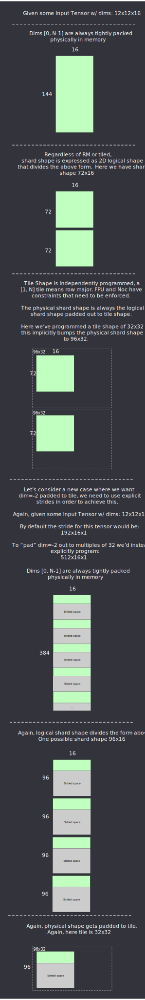

# Tensor Layout

The tensor layout attribute captures how tensor data is sharded across a grid of devices, cores, and
is laid out in memory.

## Motivation / High level goals

- **Logical shapes**: Keep the original tensor shape and rank intact and agnostic
  to underlying storage layout.
  Keeping the logical shapes not only makes some graph transformations vastly
  simpler, in particular convs, but it makes the lowered IR much easier to read
  and reason about.  The original tensor shapes leave breadcrumbs that make it
  much easier to map back to the input representation.
- **Flexible sharding**: Enable flexibility in choosing grid shape, to get better
  parallelization and avoid resharding. This is particularly important in cases
  where tensor shapes are not clean powers of two and would otherwise force our
  hand in choosing non-optimal grid shapes.
- **Logical-Physical Isomorphism**: Encode this information with just a few
  attributes to enable derived conversions from logical to physical layout and back.
- **Explicit**: A single source of truth.
- Enable a direct way to query padded regions.

## An Example / Walkthrough

Let's consider a snippet of MLIR:
```mlir
tensor<2x3x64x128xf32>
```

Here we've defined a 4 dimensional tensor using MLIR's builtin tensor type. This
tensor type has an optional attribute called an *Encoding*, this attribute has
been used by the TT dialect to encode the tensor's layout.  This looks like:

```mlir
tensor<2x3x64x128xf32,
  #ttcore.metal_layout<
    (d0, d1, d2, d3) -> (d0 * 192 + d1 * 64 + d2, d3),
    undef,
    <1x1>,
    memref<384x128xf32, #ttcore.memory_space<l1>>
  >
>
```

At the time of this writing there are 4 properties that make up a tensor layout:
- `linear`: An [affine map](https://mlir.llvm.org/docs/Dialects/Affine/#affine-maps)
  that defines how the logical tensor dimensions map to a grid shape.  Note that
  the number of dims in the affine map *must* match exactly the rank of the
  original tensor, and the number of results *must* match exactly the rank of
  the grid shape.
- `oob_val`: A tracked *out of bounds* value that fills padding space.
- `grid`: The grid shape that this tensor is divided onto.
- `memref`: A [memref](https://mlir.llvm.org/docs/Dialects/Builtin/#memreftype)
  that describes the physical footprint allocation of the shard. It *must* also
  have a shape with rank equal to grid.

This example isn't particularly complicated because it's only sharded to a 1x1
grid, the rest of the document will go into more details on the following
topics:

- [Dimension Collapsing](#dimension-collapsing)
- [Multi-Core](#multi-core)
- [Tilized](#tilized)
- [Padding](#padding)
- [Memory Spaces](#memory-spaces)
- [Multi-device](#multi-device)

> Before we jump into more advanced topics there are two resources that could be
> useful to have at hand:
>  - `test/python/tensor_layout.py`: Python test with many convenience functions
>    for creating and experimenting with tensor layouts.
>  - [TTNN Interactive Visualizer](tensor-layout-interactive.html): An
>    interactive visualization tool that demonstrates the transformation.  Note
>    that this tool was created for TTNN tensor layout, but many of the same
>    concepts transfer over.

### Dimension Collapsing

Probably the most important concept in `ttcore.metal_layout` is dimension collapsing.
This is captured by the affine map `linear` property which provides a
mapping from tensor dim space to a reduced physical dimensional space.  This
single-handedly touches on most of the tensor layout goals mentioned at the
beginning of the doc:
- Leaves tensor shapes intact
- Logical-Physical mapping, how the tensor is laid out in memory over a grid
- Enables more flexible sharding
- Explicit padding

To see how these goals are achieved we'll continue working on an explicit example,
same one as above:
```mlir
(d0, d1, d2, d3) -> (d0 * 192 + d1 * 64 + d2, d3)
```

To recap, we have our example 4d tensor `(2, 3, 64, 128)`, which maps directly to the
LHS `(d0, d1, d2, d3)`.  We have our 2d grid shape `(1, 1)`, notice the
affine-map RHS is also 2d, and this describes how tensor dims map to a lower dimensional
physical memory, overlaid on a grid.  We'll see how this gets divided onto the grid later,
but first let's look at how this forms an affine-map iteration space.  If we
index our tensor at say `[1, 1, 6, 100]`, we can simply plugin those numbers
to get our remapped offset:
```mlir
(1 * 192 + 1 * 64 + 6, 100) = (262, 100)
```

This remapped offset `(262, 100)` corresponds to the row and column index of the
collapsed physical memory.

By default, the dim range `[0, -1)` is collapsed, but the `ttcore.metal_layout` constructor
can actually take a programmable range called `collapseIntervals`.
`collapseIntervals` is a list of pairs, where each pair is a dim range interval,
left inclusive, right exclusive. Let's consider a few examples:

> Instead of multiplying out real shapes, we will use `<>` to represent a
> dimension join operator.

- 3D tensor onto a 2D grid and default `collapseIntervals=[(0, -1)]`:
```
(d0, d1, d2) -> (d0 <> d1, d2)
```
- 4D tensor onto a 3D grid and `collapseIntervals=[(1, -1)]`:
```
(d0, d1, d2, d3) -> (d0, d1 <> d2, d3)
```
- 4D tensor onto a 3D grid and `collapseIntervals=[(0, 2)]`:
```
(d0, d1, d2, d3) -> (d0 <> d1, d2, d3)
```
- 7D tensor onto a 4D grid and `collapseIntervals=[(0, 3), (-3, -1)]`:
```
(d0, d1, d2, d3, d4, d5, d6) -> (d0 <> d1 <> d2, d3, d4 <> d5, d6)
```

### Multi-core

Let's consider the original example again, but on a larger grid than `1x1`, say `2x4`:

```mlir
tensor<2x3x64x128xf32,
  #ttcore.metal_layout<
    (d0, d1, d2, d3) -> (d0 * 192 + d1 * 64 + d2, d3),
    undef,
    <2x4>,
    memref<192x32xf32, #ttcore.memory_space<l1>>
  >
>
```

The number of affine map results, grid shape, and memref shape all must have the
same rank.  We can see in this example by changing the grid shape we also
changed the memref shape, we can always calculate the memref shape by plugging
in the full tensor dims into our affine map and then dividing by grid shape.

```
(d0, d1, d2, d3) -> (d0 * 192 + d1 * 64 + d2, d3),
(2 - 1, 3 - 1, 64 - 1, 128 - 1) = (1 * 192 + 2 * 64 + 63, 127) = (383, 127)
```

Above we actually subtracted 1 in order to get the index of the last element of
the tensor. Now we can simply add back 1 to get the size:

```
(383 + 1, 127 + 1) = (384, 128)
```

Finally, we divide the dims by the respective grid dims:

```
(384 / 2, 128 / 4) = (192, 32)
```

Here's a few more example mlir snippets:

```mlir
tensor<8x300xf32,
  #ttcore.metal_layout<(d0, d1) -> (d0, d1),
    undef,
    <1x2>,
    memref<8x150xf32, #ttcore.memory_space<l1>>
  >
>

tensor<8x96x32xf32,
  #ttcore.metal_layout<(d0, d1, d2) -> (d0 * 96 + d1, d2),
    undef,
    <2x1>,
    memref<384x32xf32, #ttcore.memory_space<l1>>
  >
>

tensor<8x96x32xf32,
  #ttcore.metal_layout<(d0, d1, d2) -> (d0 * 96 + d1, d1, d2),
    undef,
    <2x1x2>,
    memref<384x96x16xf32, #ttcore.memory_space<l1>>
  >
>

tensor<5x3x2x2x7x32x32xf32,
  #ttcore.metal_layout<
    (d0, d1, d2, d3, d4, d5, d6)
      -> (d0 * 2688 + d1 * 896 + d2 * 448 + d3 * 224 + d4 * 32 + d5, d4, d5, d6),
    undef,
    <3x2x2x2>,
    memref<4480x4x16x16xf32, #ttcore.memory_space<l1>>
  >
>
```

A couple of final notes regarding grid shape:
- Grid shapes of rank > 2 are
  perfectly legal.  Not only it this useful for describing multi-device grid
  topologies, but it is often convenient to have higher ranked grids to better
  describe how a high rank tensor should be divided. The grid shape here is a
  virtual grid shape, the `ttcore.device` attribute will hold an additional affine map
  that defines how this virtual grid shape maps to a physical one.
- Grid shapes where either columns or rows are > physical device grid is also
  legal. Since this is only a virtual grid shape we could have some grid `1x64`
  that maps to a physical `8x8` device grid (this particular example is called
  width sharding in TTNN).

### Tilized

A tilized tensor is one with a memref that has a tile element type.

Given some tensor with scalar layout:
```mlir
tensor<3x64x128xf32,
  #ttcore.metal_layout<
    (d0, d1, d2) -> (d0 * 64 + d1, d2),
    undef,
    <3x2>,
    memref<64x64xf32, #ttcore.memory_space<l1>>
  >
>
```

After tilizing we'll have:
```mlir
tensor<3x64x128xf32,
  #ttcore.metal_layout<
    (d0, d1, d2) -> (d0 * 64 + d1, d2),
    undef,
    <3x2>,
    memref<2x2x!ttcore.tile<32 x 32, bfp_bf8>, #ttcore.memory_space<l1>>
  >
>
```

Notice the `memref` dim was `ceilDiv`'d by tile shape and the element type becomes
a `ttcore.tile` type.  Also notice that the tensor shape and element type remains
intact.

### Padding

Padding can be a bit of an overloaded term, but in this context it refers to an
out of bounds area in the physical memory allocation that has no real tensor
data in it.  The contents of this area is tracked by `oob_val` and the padding
area can be automatically derived from the attributes of `ttcore.metal_layout`.

Padding is a necessary evil that arises when a tensor is not evenly divisible by
a grid shape or tile shape.  It can also arise due to minimum Noc addressing
requirements.

Example of non-divisible grid:
```mlir
tensor<53x63xf32,
  #ttcore.metal_layout<
    (d0, d1) -> (d0, d1),
    undef,
    <3x2>,
    memref<18x32xf32, #ttcore.memory_space<l1>>
  >
>
```

The grid dims always `ceilDiv` the affine map results, real tensor data will
entirely fill initial shards and the last shard in each dimension will be
partially filled.

In this particular example, we have 1 scalar row of padding on the last row of
cores and 1 scalar column of padding on the last column of cores.

Taking the above example a step further, we could tilize it:
```mlir
tensor<53x63xf32,
  #ttcore.metal_layout<
    (d0, d1) -> (d0, d1),
    undef,
    <3x2>,
    memref<1x1x!ttcore.tile<32 x 32, bfp_bf8>, #ttcore.memory_space<l1>>
  >
>
```

Tile dims also always `ceilDiv` the resulting `memref` shape. Notice now that
the padding is slightly more complicated. Our scalar shard shape was `18x32`,
but this was further padded to `32x32` meaning that every core now has 14 rows
of padding except for the last row of cores which has 15 rows of padding.

Also note that there is an order of operations here, grid divides the scalar
shape first and then we tilize. This is important because it can enable use
cases that frequently arise in conv networks that would otherwise result in
reshards in between every layer.

With affine map we can be even more flexible in how we pad, we can bump our
stride between dimensions.  Consider tensor (w/ batch dim `2`):

```mlir
tensor<2x8x32xf32,
  #ttcore.metal_layout<
    (d0, d1, d2) -> (d0 * 8 + d1, d2),
    undef,
    <1x2>,
    memref<16x16xf32, #ttcore.memory_space<l1>>
  >
>
```

If we tilized the above tensor we'd end up with a `memref` shape of
`1x1x!ttcore.tile<32x32>`, that is, all batches are tightly packed within a single
tile. Let's say that for some reason, we do not want the batches (`2`) to be
tightly packed within a tile, perhaps the mathematical operation we're doing
requires the batch to be independently evaluated and thus the (S)FPU needs them
in separate tiles.  We can adjust this by adjusting the stride of the affine
map:

```
(d0, d1, d2) -> (d0 * 32 + d1, d2),
```

Instead of striding by the number of logical rows, `8`, we bump the stride up to
`32` effectively pushing a gap between the collapsed rows and enabling each
batch to fall on a tile boundary.

### Memory Spaces

At the time of writing this document there are 4 memory spaces:

1. `System`: Host memory space that is not device visible.
2. `SystemMMIO`: Host memory space that is device visible.
3. `DeviceDRAM`: DRAM local to the device.
4. `DeviceL1`: SRAM on each core.

Something worth noting here is that a tensor must belong exclusively to only
one of these memory spaces at a time.  For example, in order to stream tensor
data from `DeviceDRAM` to `DeviceL1` you would need to either manually slice the
tensor into smaller tensors that do fit in L1 or have native support in the op's
kernel for double buffering a block (most TTNN ops already support this).

### Multi-device

Multi-device can be naturally represented via a combination of two concepts
already touched on above, higher ranked grids and `collapseIntervals`.  Let's
consider the following example with a 3d grid and `collapseIntervals=[(1, -1)]`.

```mlir
tensor<2x3x64x128xf32,
  #ttcore.metal_layout<(d0, d1, d2, d3) -> (d0, d1 * 64 + d2, d3),
    undef,
    <2x2x4>,
    memref<1x3x1x!ttcore.tile<32 x 32, bfp_bf8>, #ttcore.memory_space<l1>>
  >
>
```

Here we've left the batch dim intact and started collapsing
at `d1`.  This enables us to define a 3d grid where the outermost grid dim
divides the batch directly.  This could map to a 2 device system where the batch
dim is evenly divided between 2 devices. Within each device this op runs on a
`2x4` grid.

The high level takeaway here is that how a tensor is logically divided up is
decoupled from its mapping to physical compute resources.  This has a nice
property that data parallel extends to any tensor dimension and is captured
under the same grid primitive that also divides tensor rows and columns.

## Test Plan

- `test/python/tensor_layout.py`: Assertions for `LayoutAttr` to make sure it's
  spec compliant.
- Sweep tests:
  - Grid dim sweeps
  - Tilize / untilize sweeps
  - Padding sweeps
- Multi-device tests

## Concerns

- `ttcore.metal_layout` is deliberately flexible and tries to capture as many problematic
  use-cases we've ran into in the past in a single, succinct representation.
  This flexibility will need to be further constrained by backends to avoid
  unsupported programming of this attribute.
- Optimization solution space is potentially large with all of this flexibility.
  Two things that I hope can help protect us here:
    - By and large the heuristic we'll be following is just max the grid at all
      costs. This should really narrow down the solution space to only a handful
      of options and we only keep exploring if producers/consumers end up with
      nasty reblocking.
    - We can constrain the optimizer heuristics as aggressively as possible in
      the beginning and just advertise the full flexible options to the UI model
      explorer. Hopefully this enables us to experiment with crazier grid layouts
      and prove it's worthwhile before writing an algorithm.

<br>
<br>
<br>

---

<br>
<br>
<br>

# TTNN Tensor Layout

The above section of this document covers how the compiler models tensor layout.
There are some slight differences in TTNN, but the high level idea of collapsing
dims is still used.

## Terms

- `shape`: Always logical shape, n-dimensional
- `stride`: Same as pytorch stride, but this is crucial for describing how n-dimensional data gets packed into a 2D physical layout. This 2D physical layout is always the inner dim (-1) wide and dims [0, N-1] are collapsed into rows derived from stride
- `shard_shape`: Also a logical shape, describes a 2d region that chunks physical_shape . Note this does not need to be a tile multiple
- `physical_shard_shape`: The shard_shape padded out to tile_shape
- `tile_shape`: A programmable tile shape, though constraints must check that it's compatible with an op's usage, i.e. FPU/Noc compatible
- `grid_shape`: [divup(stride[0] // stride[-2], shard_shape[0]), divup(stride[-2], shard_shape[0])]

## Mapping from the compiler

The compiler uses an affine map to explicitly track which dimensions are folded
together, but TTNN does not have affine maps so the representation is a bit more
implicit.  TTNN captures the dimension collapsing in the `stride` attribute
where dimensions `[0, N-1]` are always collapsed.  This is less flexible so the
compiler will have to enforce only collapsing supported dimensions when
targeting TTNN, or handle lowering in a different way.  For example, in the
compiler we might want to represent data parallel over the tensor batch dim by
leaving `d0` and collapsing `d1 - d[-1]`.  TTNN doesn't support this in its
tensor layout representation, but this could be lowered to a TTNN mesh tensor
where the mesh could be sliced on the batch and each per-device tensor has `d0`
fully collapsed.

## TTNN Example


