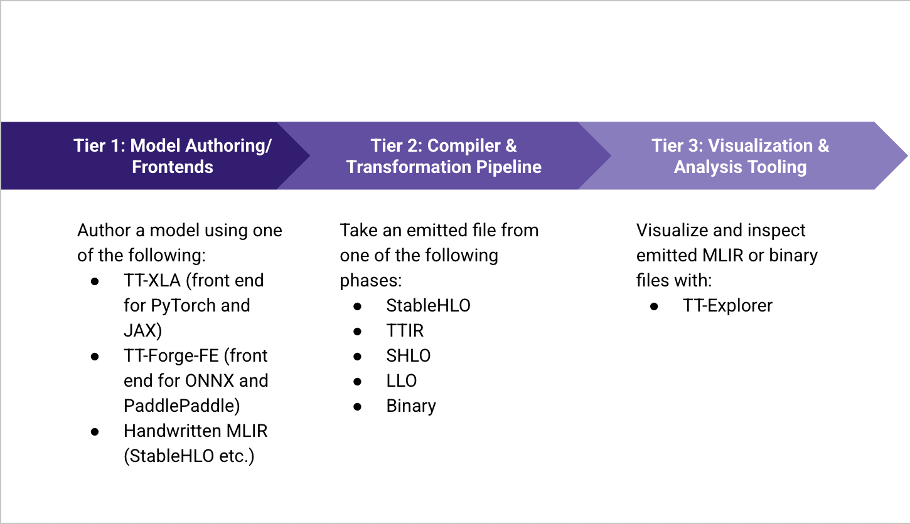

# TT-Explorer

Welcome to the TT-Explorer wiki! TT-Explorer is a visualization and exploration tool included in the TT-MLIR repository. Based on [Google's Model Explorer](https://ai.google.dev/edge/model-explorer), TT-Explorer is adapted for use with Tenstorrent's custom, open-source compiler stack. Using TT-Explorer, you can:
* Analyze and inspect models
* Visualize models (attributes, performance results)
* Explore models across SHLO, TTIR, and TTNN dialects
* Interactively debug or experiment with IR-level overrides.

TT-Explorer is for use with TT-MLIR compiler results. It takes emitted MLIR files, converts them to JSON, and displays them. There are five main levels the emitted TT-MLIR file is likely to be at, and all are supported for TT-Explorer:
* **TTNN** - High-level, PyTorch style ops (for example, `ttnn.conv2d`) used for writing and compiling models in a user-friendly format.
* **TTIR** - Mid-level intermediate representation (IR) that introduces hardware concepts like tensor tiling, memory layouts, and op fusion. Maps to hardware capabilities.
* **SHLO** - Scalar Hardware Lowering Ops, each op is close to a single hardware instruction.
* **LLO** - Lower-level ops that are close to binary. May be involved in scheduling and core-level placement.
* **Binary / Firmware** - Final compiled binaries that are loaded onto Tenstorrent chips.



## Prerequisites

* Configure your Tenstorrent hardware
* Configure the [Tenstorrent software stack](https://docs.tenstorrent.com/getting-started/README.html#running-the-installer-script)

## Quick Start

This section explains how to install TT-Explorer. Do the following:

1. TT-Explorer comes packaged as a tool in the TT-MLIR repo. Clone the TT-MLIR repo:

```bash
git clone https://github.com/tenstorrent/tt-mlir.git
```

2. Navigate into the **tt-mlir** repo.

3. The environment gets installed into a toolchain directory, which is by default set to `/opt/ttmlir-toolchain`, but can be overridden by setting the environment variable `TTMLIR_TOOLCHAIN_DIR`. You need to manually create the toolchain directory as follows:

```bash
export TTMLIR_TOOLCHAIN_DIR=/opt/ttmlir-toolchain/
sudo mkdir -p "${TTMLIR_TOOLCHAIN_DIR}"
sudo chown -R "${USER}" "${TTMLIR_TOOLCHAIN_DIR}"
```

4. Ensure you do not have a virtual environment activated already before running the following command:

```bash
source env/activate
```

>**NOTE:** These commands can take some time to run. Also, please note that the virtual environment may not show at the end of this step.

5. In this step, you build the TT-MLIR project. To build so that you can use TT-EXPLORER, the following flags must be included for your build:
   * `-DTT_RUNTIME_ENABLE_PERF_TRACE=ON`
   * `-DTTMLIR_ENABLE_RUNTIME=ON`
   * `-DTT_RUNTIME_DEBUG=ON`
   * `-DTTMLIR_ENABLE_STABLEHLO=ON`

The commands are:

```bash
source env/activate
cmake -G Ninja -B build \
   -DTT_RUNTIME_ENABLE_PERF_TRACE=ON \
   -DTTMLIR_ENABLE_RUNTIME=ON \
   -DTT_RUNTIME_DEBUG=ON \
   -DTTMLIR_ENABLE_STABLEHLO=ON
```

6. Build the `explorer` target in the **tt-mlir** directory:

```bash
cmake --build build -- explorer
```

7. Run `tt-explorer` in the terminal to start a `tt-explorer` instance. (Refer to the CLI section in the API for specifics)
   - **Note**: `tt-explorer` requires [Pandas](https://pypi.org/project/pandas/) in addition to the `tt-mlir` [System Dependencies](https://docs.tenstorrent.com/tt-mlir/getting-started.html#system-dependencies).

8. Ensure the server has started in the `tt-explorer` shell instance. Check for the following message:

   ```bash
   Starting Model Explorer server at:
   http://localhost:8080
   ```

### Running TT-Explorer CI Tests Locally

This section describes how to run CI tests as well as how to reproduce and debug failing CI tests locally. Make sure you are familiar with how to build and run TT-Explorer before starting this section.

TT-Explorer relies on tests that are present in the `test/` directory as well as tests dynamically created through `llvm-lit`. Below are the steps to replicate the testing procedure seen in CI:

1. Make sure you're in the `tt-mlir` directory
2. You need to build the explorer target with `cmake --build build -- explorer`
3. Run and save the system descriptor `ttrt query --save-artifacts`
4. Save the system variable `export SYSTEM_DESC_PATH=$(pwd)/ttrt-artifacts/system_desc.ttsys`
5. Run and generate ttnn + MLIR tests: `cmake --build build -- check-ttmlir`
6. Save the relevant test directories:
   - `export TT_EXPLORER_GENERATED_MLIR_TEST_DIRS=$(pwd)/build/test/python/golden/ttnn,$(pwd)/build/test/ttmlir/Silicon/TTNN/n150/perf`
   - `export TT_EXPLORER_GENERATED_TTNN_TEST_DIRS=$(pwd)/build/test/python/golden/ttnn`
7. Run the pytest for `tt-explorer` with `pytest tools/explorer/test/run_tests.py`

As a shell script it looks like this:

```sh
# Ensure you are present in the tt-mlir directory
source env/activate

# Build Tests
cmake --build build -- explorer
ttrt query --save-artifacts
export SYSTEM_DESC_PATH=$(pwd)/ttrt-artifacts/system_desc.ttsys
cmake --build build -- check-ttmlir

# Load Tests
export TT_EXPLORER_GENERATED_MLIR_TEST_DIRS=$(pwd)/build/test/python/golden/ttnn,$(pwd)/build/test/ttmlir/Silicon/TTNN/n150/perf
export TT_EXPLORER_GENERATED_TTNN_TEST_DIRS=$(pwd)/build/test/python/golden/ttnn

# Run Tests
pytest tools/explorer/test/run_tests.py
```
