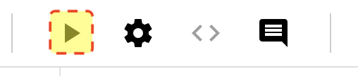
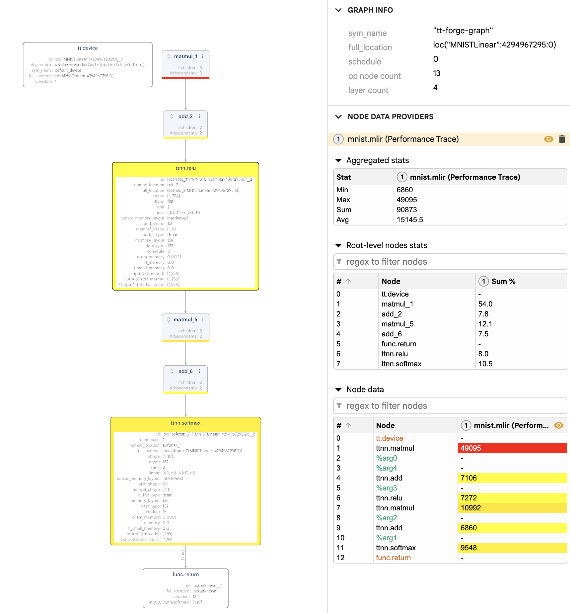
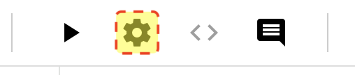
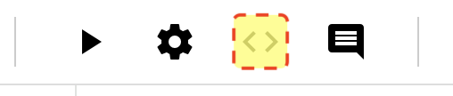
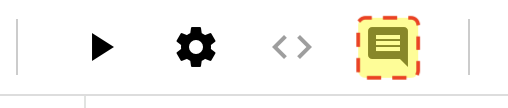
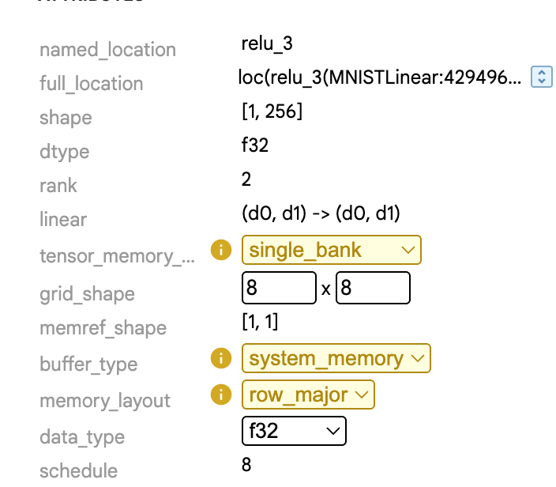

# TT-Explorer UI

For general details about the  UI, refer to [Google's Model Explorer wiki](https://github.com/google-ai-edge/model-explorer/wiki). This page highlights unique UI elements added to the Tenstorrent fork of Google's Model Explorer.

## Model Execution

TT-Explorer adds a toolbar to the top of the screen that features the following icons in order of appearance:
* Execute Model (Play icon)
* Model Execution Settings (Gear icon)
* Generated C Code (Angle Brackets icon)
* Log Messages (Comment Bubble icon)

## Run / Execute

The play icon invokes the `execute` function which compiles and executes the model. The icon then displays as loading until execution is finished. Pressing the icon does the following:
1. Runs the model through the `tt-mlir` pipeline. 
2. Updates the visualization with results from the server execution. 
3. Creates overlays on the graph after the model executes. These overlays use color to visually communicate how long different nodes take to complete during execution. 

### Performance Overlay

After every execution, the performance overlay appears. It uses a color gradient from yellow to red to represent the execution time of each node:
* Yellow nodes represent the fastest execution times (relative to other nodes).
* Red nodes indicate the slowest execution times.

This helps you quickly identify bottlenecks or costly operations in the model graph.

### Accuracy Overlay

The accuracy overlay only appears after executing from a compatible flatbuffer (`.ttnn` file extension with debug info included). It shows a pass/fail status for each node based on a comparison against a "golden" (expected) reference:
* Green nodes passed the accuracy check
* Red nodes failed the check

This overlay is useful for validating that model outputs remain correct after transformations or optimizations.

The overlay value represents the difference between the actual Pearson Correlation Coefficient (PCC) for the node's output and the expected PCC from the golden reference. If the PCC difference is negative (lower than expected), the node fails the accuracy check. Otherwise it is considered accurate.

## Advanced Settings

Clicking the gear icon opens a menu with advanced settings for model execution.

### Optimization Policy

This dropdown provides a list of **Optimization Policies** which can be applied when lowering from a `ttir` module to an executable `ttnn` module.

### Generate C++ Code

This toggle runs the `EmitC` pass in the `tt-mlir` compiler to generate TTNN C++ Code and make it available to you after running a model. The default value for this toggle is `Off`.

## Code Icon

If the `Generate C++ Code` option is enabled, this button will become available to view and download the C++ code in a window within explorer.

## Logs Icon

This button will open a window to view the shell logs while execution is running. If any errors occur they will be displayed here.

## Overridden Fields

Certain nodes on the graph have attributes that are presented as editable fields. These are fields which have overrides available. This value can be changed and then sent to be recompiled, with invalid configurations resulting in errors.
