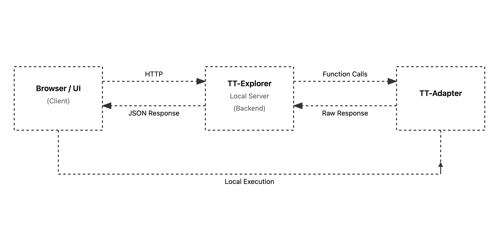
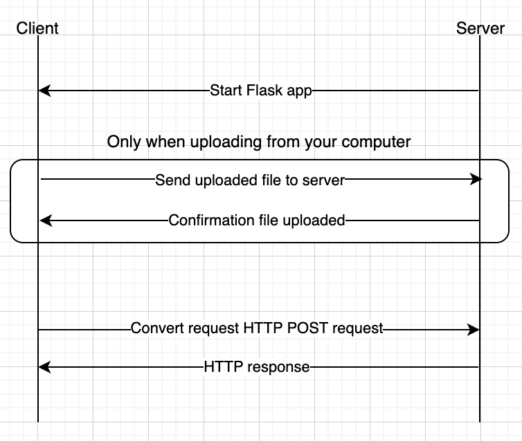

# `tt-explorer` - API
This page documents the TT-Adapter API, the programmatic interface provided by TT-Explorer, Tenstorrent’s fork of Google’s Model Explorer. While Model Explorer focuses on visualizing and interacting with machine learning models through its UI, TT-Explorer extends it with the ability to send commands, convert models, execute them, and query execution status programmatically, leveraging the same underlying graph structures and model representations that Model Explorer uses.

The TT-Adapter API enables automation of workflows, integration of model execution into scripts, and interaction with models on the server without relying on the UI. This reference explains request and response formats, supported commands, and how editable attributes are represented, providing all the details needed to work with TT-Explorer programmatically.

It is especially useful when managing multiple models, performing batch conversions, or integrating TT-Explorer functionality into automated pipelines — tasks that would be cumbersome or impractical through the UI alone.

## TT-Adapter

This section provides a reference for the TT-Adapter REST API, as well as an explanation of how TT-Explorer creates an extensible API on top of Google's Model Explorer.

### Building an API using Model Explorer

Google's Model Explorer defines the endpoint `/apipost/v1/send_command` as a generic command-receiving mechanism. This endpoint lets the server accept requests to perform operations on a model. Specifically, it:
* Accepts JSON commands describing an action (for example, convert a model or run an analysis).
* Parses commands to ensure they follow the correct format.
* Forwards the command to the installed adapter—here, TT-Adapter.
* Wraps the output in a standard JSON response that the UI (TT-Explorer’s interface) can interpret.

This endpoint provides the main communication channel between the client and server. Commands sent here are executed by the specified adapter and return a structured “adapter response,” allowing developers to interact programmatically with models through TT-Explorer.

#### Flow Overview

This section provides a general overview of how commands flow between the client and server.





##### Flow for File Upload From Computer

1. Server starts the Flask app.

2. (This step occurs when uploading a file from your computer rather than using a link.) Client sends the uploaded file to the server.

3. Server sends confirmation the file uploaded.

4. Server (Backend) forwards commands to the TT-Adapter for execution.

5. TT-Adapter executes the model / graph operations locally (may reuse upstream code).

6. Adapter produces a raw response → Server processes it via `convert_adapter_response`.

7. Server returns JSON-wrapped results to the UI, which renders graphs, overlays, and status.

##### Flow for Link Upload

1. Server starts the Flask app.

2. Client sends the link to the file with a convert request (HTTP POST request).

3. Server sends an HTTP response to the UI, which renders graphs, overlays, and status.

4. Server (Backend) forwards commands to the TT-Adapter for execution.

5. TT-Adapter executes the model / graph operations locally (may reuse upstream code).

6. Adapter produces a raw response → Server processes it via `convert_adapter_response`.

7. Server returns JSON-wrapped results to the UI, which renders graphs, overlays, and status.

#### Sending Commands

Commands sent to the `/apipost/v1/send_command` endpoint must be formatted as JSON and follow a standard structure. The base structure is described using a [Typescript interface](https://www.typescriptlang.org/docs/handbook/2/everyday-types.html#interfaces) for clarity, though in practice it is just a JSON object. Specific commands may add extra fields or restrict some values, but all fields in the base interface must still be present for the server to process the command correctly.

```typescript
interface ExtensionCommand {
	cmdId: string;
	extensionId: string;
	modelPath: string;
	settings: Record<string, any>;
	deleteAfterConversion: boolean;
}
```

On the server side, all functions that handle commands must follow this required parameter signature:

```python
class TTAdapter(Adapter):
  # ...
  def my_adapter_fn(self, model_path: str, settings: dict):
    # Parse model_path and settings objects as they are fed from send_command endpoint.
    pass
```

Information does not persist between requests—each request gets a new instance of TT-Adapter. As all requests to the server are stateless, each command-handling function receives input only through its parameters (`model_path` and `settings`). Any data needed for execution must be passed in the request, and the client is responsible for keeping track of important information such as the path of an uploaded model or the locations of artifacts produced by the server.

This design ensures that each request is isolated and predictable, while the `settings` dictionary provides a flexible way to supply additional context for execution. For example, `ModelRunner:initialize` ignores its parameters entirely and performs a static initialization regardless of the values passed.

#### Example Request

Below is an example of the JSON request sent from the UI to the server:

```json
{
	// tt_adapter to invoke functions from TT-Adapter
	"extensionId": "tt_adapter",
	// Name of function to be run, "convert" is built into all adapters to convert some model to graph
	"cmdId": "convert",
	// Path to model on server to be fed into function
	"modelPath": "/tmp/tmp80eg73we/mnist_sharding.mlir",
	// Object holding custom settings to be fed into function
	"settings": {
		"const_element_count_limit": 16,
		"edge_label_font_size": 7.5,
		"artificial_layer_node_count_threshold": 1000,
		"keep_layers_with_a_single_child": false,
		"show_welcome_card": false,
		"disallow_vertical_edge_labels": false,
		"show_op_node_out_of_layer_edges_without_selecting": false,
		"highlight_layer_node_inputs_outputs": false,
		"hide_empty_node_data_entries": false
	},
	// `true` if file at `modelPath` is to be deleted after function run
	"deleteAfterConversion": true
}
```

### Adapter Response Processing

TT-Explorer extends Model Explorer with an adapter framework, but the original Model Explorer was not designed for this level of extensibility. As a result, adapter responses must be processed in a specific way before being returned to the client.

The function [`model_explorer.utils.convert_adapter_response`](https://github.com/google-ai-edge/model-explorer/blob/main/src/server/package/src/model_explorer/utils.py#L40) is applied to the output of every adapter function. This ensures compatibility with the upstream (Google Model Explorer) implementation and enforces a consistent response format.

For compatibility, all responses sent from the server (the backend component of TT-Explorer that executes adapter commands) must:
* Be in JSON format
* Wrap the payload within a `graphs` property

The TypeScript interface expected by the UI is as follows:

```typescript
/** A response received from the extension. */
interface ExtensionResponse<
	G extends Array<unknown> = Graph[],
	E extends unknown = string
> {
	graphs: G;
	error?: E;
}
```

Custom adapter responses must conform to this structure. This restriction prevents the direct transfer of raw bytes through unsupported MIME types and requires the use of `tt_adapter.utils.to_adapter_format`, which converts any Python `dict` into a Model Explorer–compatible adapter response. While this framework works well for graphs, it makes building a fully extensible API more challenging. All responses must fit within the `graphs` JSON wrapper and adhere to a fixed structure.

## Current API Reference

This section shows all the different API functions that are available:

### `convert`

Standard built-in conversion function, converts TTIR Module into Model Explorer Graph. Also provides `settings` as a platform for overrides to be applied to the graph.

#### Request

```typescript
// As this is the base request everything is based off,
// this interface only narrows down the command to be "convert".
interface AdapterConvertCommand extends ExtensionCommand {
	cmdId: 'convert';
}
```

#### Response

```typescript
// As this is the base response everything is based off,
// it is exactly the same as `ExtensionResponse`.
type AdapterConvertResponse = ExtensionResponse;
```

```json
{
	"graphs": [{
		// Model Explorer Graph JSON Object
	}]
}
```

### `initialize`

Called from `TTAdapter.__init__`, used to Load SystemDesc into environment.

#### Request

```typescript
interface InitializeCommand extends ExtensionCommand {
	cmdId: 'initialize';
}
```

#### Response

```typescript
type AdapterInitializeResponse = ExtensionResponse<[{
	system_desc_path: string
}]>;
```

```json
{
	"graphs": [{
		"system_desc_path": "<path to system_desc.ttsys>"
	}]
}
```

### `execute`

Called from `TTAdapter.execute`, executes a model.

#### Request

```typescript
interface AdapterExecuteCommand extends ExtensionCommand {
	cmdId: 'execute';
}
```

#### Response

```typescript
// When the request is successful, we don't expect any response back.
// Thus, an empty array is returned for `graphs`.
type AdapterExecuteResponse = ExtensionResponse<[]>;
```

```json
{
	"graphs": []
}
```

### `status-check`

Called from `TTExplorer.status_check`, it is used for checking the execution status of a model and update the UI accordingly.

#### Request

```typescript
interface AdapterStatusCheckCommand extends ExtensionCommand {
	cmdId: 'status_check';
}
```

#### Response

```typescript
type AdapterStatusCheckResponse = ExtensionResponse<[{
	isDone: boolean,
	progress: number,
	total?: number,
	timeElapsed?: number,
	currentStatus?: string,
	error?: string,
	stdout?: string,
	log_file?: string
}]>;
```

```json
{
	"graphs": [{
		"isDone": false,
		"progress": 20,
		"total": 100,
		"timeElapsed": 234,
		"stdout": "Executing model...\nPath: /path/to/model",
		"log_file": "/path/to/log/on/the/server"
	}]
}
```

## Editable Attributes

To enable an attribute to be edited, a response coming from the server should contain the `editable` field on the attribute.

The typescript interface is as follows:

```typescript
interface Graph {
	nodes: GraphNode[];
	// ...
}

interface GraphNode {
	attrs?: Attribute[];
	// ...
}

type EditableAttributeTypes = EditableIntAttribute | EditableValueListAttribute | EditableGridAttribute; // Attribute types are defined below...

interface Attribute {
	key: string;
	value: string;
	editable?: EditableAttributeTypes; // <- the editable attribute information
	// ...
}
```

### `EditableIntAttribute`

This editable attribute represents a list of integer values. It expects the **attribute `value`** to be formatted as a string, starting with `[` and ending with `]`, with all values separated by `,`. Like the example below:

```
[1, 2, 3]
```

The typescript interface for the `editable` attribute is this:

```typescript
interface EditableIntAttribute {
  input_type: 'int_list';
  min_value?: number = 0;
  max_value?: number = 100;
  step?: number = 1;
}
```

Both `min_value` and `max_value` define the accepted range of values, and `step` define the number to increment or decrement per step.

The default range of values is between `0` and `100`, inclusive, and the default step is `1`. Thus by default, the value will increment or decrement by `1` each time to a minimum of `0` and a maximum of `100`.

Here is an example of what this attribute look like:

```json
{
	"graphs": [{
		"nodes": [
			{
				"attrs": [
					{
						"key": "shape",
						"value": "[8, 8]",
						"editable": {
							"input_type": "int_list",
							"min_value": 8,
							"max_value": 64,
							"step": 8
						}
					}
				]
			}
		]
	}]
}
```

### `EditableValueListAttribute`

This editable attribute define a fixed list of string values to display.

The typescript interface for the `editable` attribute is this:

```typescript
interface EditableValueListAttribute {
	input_type: 'value_list';
	options: string[];
}
```

The `options` property provides the list of options to be displayed. The current value will be added to this list and any duplicates will be removed.

Here is an example of what this attribute look like:

```json
{
	"graphs": [{
		"nodes": [
			{
				"attrs": [
					{
						"key": "chip_arch",
						"value": "wormhole",
						"editable": {
							"input_type": "value_list",
							"options": [
								"wormhole",
								"grayskull"
							]
						}
					}
				]
			}
		]
	}]
}
```

### `EditableGridAttribute`

The grid attribute is similar to to the integer list, with the main difference that you can specify a `separator` for the place the list will be split, and it doesn't need to be enclosed in bracket (`[` and `]`). The data for a grid attribute looks like this:

```
4x4x2
```

The typescript interface for the `editable` attribute is this:

```typescript
interface EditableGridAttribute {
  input_type: 'grid';
  separator?: string = 'x';
  min_value?: number = 0;
  max_value?: number = 100;
  step?: number = 1;
}
```

Both `min_value` and `max_value` define the accepted range of values, and `step` define the number to increment or decrement per step.

The default range of values is between `0` and `100`, inclusive, and the default step is `1`. Thus by default, the value will increment or decrement by `1` each time to a minimum of `0` and a maximum of `100`.

The `separator` attribute defines the character used to split the string, it defaults to "`x`".

Here is an example of what this attribute look like:

```json
{
	"graphs": [{
		"nodes": [
			{
				"attrs": [
					{
						"key": "grid",
						"value": "4x4",
						"editable": {
							"input_type": "grid",
							"min_value": 4,
							"max_value": 64,
							"step": 4,
							"separator": "x"
						}
					}
				]
			}
		]
	}]
}
```

## Attribute display type

To change how the attribute is displayed from plain text to something else, we do extend the attribute interface (presented above) with the `display_type` optional field.

```typescript
type AttributeDisplayType = 'memory';

interface Attribute {
	key: string;
	value: string;
	display_type?: AttributeDisplayType; // <- Optional, add a different display type.
	// ...
}
```

If the `display_type` attribute is present, and it matches one of the available values, then the attribute will display differently than the others.

In the example below, the two attributes have different display types, one shows the regular, plain text display; and the other shows the `memory` display type, which renders it as a progress bar.


### `memory`

Setting the display type to `memory` will make the attribute try to render as a progress bar.

The UI will then check the `value` property in the attribute for the following conditions:

- Is a [double precision floating point number](https://developer.mozilla.org/en-US/docs/Web/JavaScript/Reference/Global_Objects/Number#number_encoding)
- Is not [`NaN`](https://developer.mozilla.org/en-US/docs/Web/JavaScript/Reference/Global_Objects/NaN#observably_distinct_nan_values)
- Is greater than or equal to `0`
- Is less than or equal to `1`

If all of the conditions are true, then the `value` will be rendered as a progress bar.
