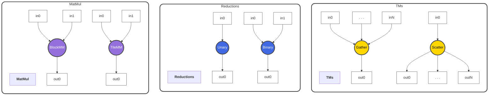
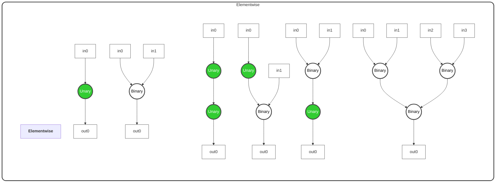

# `ttnn.jit`

`ttnn.jit` is a tool that allows TTNN model developers to leverage the Direct-To-Metal (D2M) compiler Just-In-Time (JIT) compile select portions of their model.

## Table of Contents

- [Getting Started](#getting-started)
- [How to use ttnn.jit](#how-to-use-ttnnjit)
  - [JIT Flags](#jit-flags)
- [Current Support](#current-support)
- [How It Works](#how-it-works)
  - [Level 1: Python Decorator](#level-1-python-decorator)
  - [Level 2: D2M Compilation Pipeline](#level-2-d2m-compilation-pipeline)
  - [Level 3: Runtime Execution](#level-3-runtime-execution)
  - [JIT Caching](#jit-caching)
  - [Op Fusion](#op-fusion)
- [Debugging FAQ](#debugging-faq)
  - [AssertionError: Function ___ not supported](#assertionerror-function-___-not-supported)
  - [Failed to run pass manager](#failed-to-run-pass-manager)

## Getting Started

### Quickstart
Wheel install coming soon!

### Building From Source
Build [tt-mlir](./getting-started.md) with the following flags:

```bash
-DTTMLIR_ENABLE_RUNTIME=ON -DTTMLIR_ENABLE_TTNN_JIT=ON
```

For profiling purposes, add the following flag to enable Tracy:
```bash
-DTT_RUNTIME_ENABLE_PERF_TRACE=ON
```

After building, make sure to generate a system descriptor using [ttrt](./ttrt.md).
```bash
ttrt query --save-artifacts
export SYSTEM_DESC_PATH=`pwd`/ttrt-artifacts/system_desc.ttsys
```

## How to use ttnn.jit
Take any Python TTNN subgraph such as the cosh composite operation:
```Python
def cosh(input_tensor):
  e_pos_x = ttnn.exp(input_tensor)
  e_neg_x = ttnn.exp(ttnn.neg(input_tensor))
  nr_term = ttnn.add(e_pos_x, e_neg_x)
  return ttnn.multiply(nr_term, 0.5)

def model(input_0, input_1):
  x = cosh(input_0)
  y = ttnn.exp(input_1)
  return ttnn.matmul(x, y)
```

Simply decorate with `@ttnn_jit.jit()` to JIT compile through D2M. In this example, `cosh` will be compiled into a single fused kernel.
```Python
@ttnn_jit.jit()
def cosh(input_tensor):
  e_pos_x = ttnn.exp(input_tensor)
  e_neg_x = ttnn.exp(ttnn.neg(input_tensor))
  nr_term = ttnn.add(e_pos_x, e_neg_x)
  return ttnn.multiply(nr_term, 0.5)

def model(input_0, input_1):
  x = cosh(input_0)
  y = ttnn.exp(input_1)
  return ttnn.matmul(x, y)
```

This demo is available [here](../../test/ttnn-jit/test_jit_demos.py).

### JIT Flags

| Flag | Type | Default | Description |
|------|------|---------|-------------|
| `enable_cache` | `bool` | `False` | Enables caching for compiled JIT graphs. |
| `math_fidelity` | `ttnn.MathFidelity` | `ttnn.MathFidelity.HiFi4` | Sets the math fidelity setting for the JIT graph. |
| `debug` | `bool` | `False` | Enables debug prints during compilation and execution. |
| `compile_only` | `bool` | `False` | Only compile runtime without execution. The resulting flatbuffer and kernel source files will be dumped to `generated/jit`. |

## Current Support

### Supported Operations
The following major categories of operations are supported:
- Unary Elementwise
- Binary Elementwise
- Unary Bitwise
- Binary Bitwise
- Matrix Multiplication
- Reductions

Not every operation is supported within the above categories.

### Supported Tensor Layouts
- Unary Elementwise and Bitwise
  - Height, width, and block sharded tensors in L1 as well as DRAM interleaved.
- Binary Elementwise and Bitwise
  - Height, width, and block sharded tensors in L1 as well as DRAM interleaved.
  - If both operands are sharded, they must have identical shard specs.
  - The output will match the layout of the first operand.
- Matrix Multiplication:
  - Block sharded tensors in L1 and DRAM interleaved.
  - The output will always be block sharded in L1. DRAM outputs are not supported.
- Reductions:
  - Height, width, and block sharded tensors in L1.
  - DRAM tensors are not supported.

Note: Only tiled tensors with tile-aligned dimensions are currently supported. Padding is not supported. Row-major layouts are not supported.

### Supported Datatypes
| Operation Category | Supported Datatypes |
|------|------------|
| Unary Elementwise | `f32`, `bf16`, `bfp8` |
| Binary Elementwise | `f32`, `bf16`, `bfp8` |
| Unary Bitwise | `int32` |
| Binary Bitwise | `int32` |
| Matrix Multiplication | `f32`, `bf16`, `bfp8` |
| Reductions | `f32`, `bf16` |

### Notes
- The output layout of a JIT graph cannot be selected. The `memory_config` arguments on JIT ops are ignored.
- See the current [test suite](../../test/ttnn-jit/) for what is guaranteed to be working.

## How It Works

The `ttnn.jit` decorator implements a three-step compilation and execution pipeline that transforms Python TTNN operations into optimized hardware kernels:

### Step 1: Python Decorator

When you decorate a function with `@ttnn_jit.jit()`, the decorator wraps it in a `JitFunction` object. On the first call:

- The function is traced during execution to capture all TTNN operations.
- Each TTNN operation (eg: `ttnn.exp`, `ttnn.add`) is converted to its corresponding MLIR operation in the TTIR dialect.

The output is a valid MLIR module in the TTIR dialect. The previous `cosh` [example](#how-to-use-ttnnjit) will be compiled into TTIR operations like:

```mlir
module {
  func.func @cosh(%arg0: tensor<32x32xbf16, #ttnn_layout>) -> tensor<32x32xbf16, #ttnn_layout> {
    %0 = ttir.exp %arg0 : tensor<32x32xbf16, #ttnn_layout> -> tensor<32x32xbf16, #ttnn_layout>
    %1 = ttir.neg %arg0 : tensor<32x32xbf16, #ttnn_layout> -> tensor<32x32xbf16, #ttnn_layout>
    %2 = ttir.exp %1 : tensor<32x32xbf16, #ttnn_layout> -> tensor<32x32xbf16, #ttnn_layout>
    %3 = ttir.add %0, %2 : tensor<32x32xbf16, #ttnn_layout>, tensor<32x32xbf16, #ttnn_layout> -> tensor<32x32xbf16, #ttnn_layout>
    %4 = ttir.multiply %3, 0.5 : tensor<32x32xbf16, #ttnn_layout>, f32 -> tensor<32x32xbf16, #ttnn_layout>
    return %4 : tensor<32x32xbf16, #ttnn_layout>
  }
}
```

### Step 2: D2M Compilation Pipeline

The resulting MLIR module is then passed to the compiler:

- **D2M Compilation**: The `ttir-to-ttmetal-pipeline` runs with `ttnn-mode`
  - **Generates** custom kernels with techniques such as destination fusion and loop tiling.
  - Wraps the generated kernels in **`ttnn.generic`** operations that contain the necessary host side program setup.
- **Flatbuffer Serialization**: The compiled IR is serialized to a FlatBuffer binary format via `ttnnToFlatbuffer()`
  - This flatbuffer is returned to the decorator and cached as a `Binary` object.

Each `ttnn.generic` op requires a `ProgramDescriptor` that contains everything needed to construct a TT-Metal `Program`.
- Circular buffer and Semaphore config.
- Kernel source code, common runtime, and compile-time argument setup.

### Step 3: Runtime Execution

The decorator leverages the same MLIR runtime as [ttrt](./ttrt.md). For our purposes, it is essentially just TTNN with additional machinery to execute the serialized `ttnn.generic` operations that wrap the custom D2M-generated kernels.

As shown in [previously](#how-to-use-ttnnjit), interop with TTNN is seamless, allowing users to switch freely between JIT'ed and non-JIT'ed subgraphs of ttnn ops.

### JIT Caching

The first invocation of a JIT'ed subgraph will compile and cache the resulting flatbuffer in a `JitCache`. The cache uses tensor **metadata** (shape, dtype, memory config, etc.) as the key. The compiled flatbuffer wrapped in an MLIR runtime `Binary` object is the cache entry.

Each `JitFunction` maintains its own `JitCache`, so different JIT [configurations](#jit-flags) will have independent cache entries.

Constructing a `ProgramDescriptor` from a flatbuffer at runtime is expensive. To mitigate this, `ProgramDescriptor` instances are cached in a `ProgramDescCache` owned by the flatbuffer `Binary` object. The same cache key is also stored in the `ProgramDescriptor` as a `custom_program_hash` and passed to the TTNN runtime, allowing the `ttnn.generic` to reuse it for its `ProgramCache`.

See [test_program_cache.py](../../test/ttnn-jit/test_program_cache.py) for a detailed example demonstrating cache hit/miss behavior.

### Op Fusion

Fusion is a key optimization in the D2M compilation pipeline that can combine multiple D2M generic operations into a single op, generating fewer kernels, reducing overhead, and improving performance. This feature is currently always enabled and runs under-the-hood with no additional input/guidance required from the user.

#### At a Glance

- **Fuses viable pairs of `d2m.generic` ops** together to eliminate/reduce redundant ops/instructions
- **Saves dispatch time** by reducing total number of kernels
- **Reduces kernel execution time** by reducing redundant `*_init` op calls
- **Reorders op call sequence** to minimize required DST memory and data movement

#### Fusion Zoo

Currently only supports elementwise ops as shown below. Currently at work on moving more ops from their cages into the Fusion Cage.

(If the figures aren't showing up, please install the support for the 'Mermaid' package in Markdown files)





#### Limitations

- **Only supports elementwise ops** (no reductions/matmuls/TMs yet)
- **Fused `d2m.generic` can't have more than 32 input/output tensors** (CB limit)
  - If all tensors have data types with <= 16b, can fuse freely until we hit CB limit
  - If any of the tensors being fused has a data type > 16b, can only fuse up-to and including 7 inputs
- **Ops with 2+ inputs** are currently lowered to loops that operate on 1xDST-tile at a time
  - Can fuse aggressively and save on dispatch but less savings on redundant ops
  - **Major revisions incoming** in later releases
- **Can only fuse over op trees** (i.e., can't fuse over tensors with multiple users)
  - **EXCEPTION**: if the tensor is a func argument, it will go through separate "tilize" `d2m.generic`s; as far as the downstream `d2m.generic`s are concerned → the output of each "tilize" is a unique tensor

#### Examples of Current Supported Patterns

Unary Op Chains
- **Fully fusable** → Fewer kernels = fewer kernel dispatches
- Op loops iterate over 8xDST-Tile blocks
- Can use init hoisting to reduce `*_init` op calls by 8x
- DST is double buffered (benefits degrade dramatically as chain gets longer)

```Python
@ttnn_jit.jit(backend="ttnn", max_grid=(7, 7), debug=False)
def unary_chain(input_tensor):
    res_0 = ttnn.abs(input_tensor)
    res_1 = ttnn.sin(res_0)
    res_2 = ttnn.neg(res_1)
    output_tensor = ttnn.exp(res_2)

    return output_tensor
```

Lowers to the singular d2m compute generic below:

```
d2m.generic { // . . . omitted . . .
^compute0(%cb0: !d2m.cb<memref<4x4x!ttcore.tile<32x32, bf16>, #ttcore.memory_space<l1>>>, %cb1: !d2m.cb<memref<4x4x!ttcore.tile<32x32, bf16>, #ttcore.memory_space<l1>>>):
  // . . . omitted . . .
  scf.for %arg1 = %c0 to %c4 step %c2 {
    scf.for %arg2 = %c0 to %c4 step %c4 {
      // . . . omitted . . .
      affine.for %arg3 = 0 to 2 {
        affine.for %arg4 = 0 to 4 {
          %2 = affine.load %subview[%arg3, %arg4] : memref<2x4x!ttcore.tile<32x32, bf16>, strided<[4, 1], offset: ?>, #ttcore.memory_space<l1>>
          affine.store %2, %dst[0, %arg3, %arg4] : memref<1x2x4x!ttcore.tile<32x32, bf16>, #ttcore.memory_space<dst>>
        }
      }
      affine.for %arg3 = 0 to 2 {
        affine.for %arg4 = 0 to 4 {
          %2 = affine.load %dst[0, %arg3, %arg4] : memref<1x2x4x!ttcore.tile<32x32, bf16>, #ttcore.memory_space<dst>>
          %3 = "d2m.tile_abs"(%2) : (!ttcore.tile<32x32, bf16>) -> !ttcore.tile<32x32, bf16>
          affine.store %3, %dst[%c0, %arg3, %arg4] : memref<1x2x4x!ttcore.tile<32x32, bf16>, #ttcore.memory_space<dst>>
        }
      }
      // Shortened IR for 2 intermediate ops
      // affine.for{affine.for{load --> "d2m.tile_sin" --> store}}
      // affine.for{affine.for{load --> "d2m.tile_neg" --> store}}

      affine.for %arg3 = 0 to 2 {
        affine.for %arg4 = 0 to 4 {
          %2 = affine.load %dst[%c0, %arg3, %arg4] : memref<1x2x4x!ttcore.tile<32x32, bf16>, #ttcore.memory_space<dst>>
          %3 = "d2m.tile_exp"(%2) : (!ttcore.tile<32x32, bf16>) -> !ttcore.tile<32x32, bf16>
          affine.store %3, %dst[0, %arg3, %arg4] : memref<1x2x4x!ttcore.tile<32x32, bf16>, #ttcore.memory_space<dst>>
        }
      }
      affine.for %arg3 = 0 to 2 {
        affine.for %arg4 = 0 to 4 {
          %2 = affine.load %dst[0, %arg3, %arg4] : memref<1x2x4x!ttcore.tile<32x32, bf16>, #ttcore.memory_space<dst>>
          affine.store %2, %subview_4[%arg3, %arg4] : memref<2x4x!ttcore.tile<32x32, bf16>, strided<[4, 1], offset: ?>, #ttcore.memory_space<l1>>
        }
      }
    }
  }
}
```

Arbitrary Binary + Unary Op Trees
- **Fully fusable** → Fewer kernels = fewer kernel dispatches
- Op loops iterate over 1xDST-Tile blocks
- No init hoisting benefits
- Op tree is evaluated and op execution order is rescheduled to minimize number of required DST registers (minimize the max number of tensors that can be live at any point during execution)
- "loads" of input data tiles are moved to immediately before their users


Sample op tree to be fused and rescheduled:

```Python
@ttnn_jit.jit(backend="ttnn", max_grid=(7, 7), debug=False)
def add_tree_8_to_1(
        in0, in1, in2, in3,
        in4, in5, in6, in7
):
        add_0_0 = builder.add(in0, in1)
        add_0_1 = builder.add(in2, in3)
        add_0_2 = builder.add(in4, in5)
        # At this point we're storing 3 intermediate results in DST tiles
        # Need 2 more DST tiles for inputs below
        # +1 more DST tile for the result
        # Peak usage of 6 DST tiles
        add_0_3 = builder.add(in6, in7)

        add_1_0 = builder.add(add_0_0, add_0_1)
        add_1_1 = builder.add(add_0_2, add_0_3)

        add_2_0 = builder.add(add_1_0, add_1_1)
```

Is rescheduled under-the-hood to the below snippet. This reordering will produce the exact same output as the original order i.e., reordering doesn't affect floating point rounding error accumulation.

```Python
        # resolve one half of the op-tree
        add_0_0 = builder.add(in0, in1)
        add_0_1 = builder.add(in2, in3)
        add_1_0 = builder.add(add_0_0, add_0_1)
        # store add_1_0 as the result of this half of the tree

        # THEN resolve other half
        add_0_2 = builder.add(in4, in5)
        # Storing add_1_0 and add_0_2 in intermediate in DST tiles
        # Need 3 more DST tiles for add_0_3
        # Peak usage of 5 DST-Tiles
        add_0_3 = builder.add(in6, in7)
        add_1_1 = builder.add(add_0_2, add_0_3)

        # combine 2 results
        add_2_0 = builder.add(add_1_0, add_1_1)
```

This will then lower into the following loop structure (assuming tensor sizes of 1024 x 1024 x bf16 and an 8x8 grid):

```
d2m.generic {// . . . omitted . . .

    ^compute0(%cb0: !d2m.cb<memref<4x4x!ttcore.tile<32x32, bf16>, #ttcore.memory_space<l1>>>, %cb1: !d2m.cb<memref<4x4x!ttcore.tile<32x32, bf16>, #ttcore.memory_space<l1>>>, %cb2: !d2m.cb<memref<4x4x!ttcore.tile<32x32, bf16>, #ttcore.memory_space<l1>>>, %cb3: !d2m.cb<memref<4x4x!ttcore.tile<32x32, bf16>, #ttcore.memory_space<l1>>>, %cb4: !d2m.cb<memref<4x4x!ttcore.tile<32x32, bf16>, #ttcore.memory_space<l1>>>, %cb5: !d2m.cb<memref<4x4x!ttcore.tile<32x32, bf16>, #ttcore.memory_space<l1>>>, %cb6: !d2m.cb<memref<4x4x!ttcore.tile<32x32, bf16>, #ttcore.memory_space<l1>>>, %cb7: !d2m.cb<memref<4x4x!ttcore.tile<32x32, bf16>, #ttcore.memory_space<l1>>>, %cb8: !d2m.cb<memref<4x4x!ttcore.tile<32x32, bf16>, #ttcore.memory_space<l1>>>):

      // . . . omitted . . .
      scf.for %arg8 = %c0 to %c4 step %c1 {
        scf.for %arg9 = %c0 to %c4 step %c1 {

          // . . . omitted . . .

          %dst = d2m.acquire_dst() : memref<8x1x1x!ttcore.tile<32x32, bf16>, #ttcore.memory_space<dst>>

          // Loads from l1/DRAM into DST are moved into the same loop as the compute ops
          // Currently any d2m.generic with 3+ inputs will lower down to so that the inner loop nest operates on only 1xTile at a time.
          // To be improved in later revisions
          affine.for %arg10 = 0 to 1 {
            affine.for %arg11 = 0 to 1 {
              %9 = affine.load %subview[%arg10, %arg11] : memref<1x1x!ttcore.tile<32x32, bf16>, strided<[4, 1], offset: ?>, #ttcore.memory_space<l1>>
              affine.store %9, %dst[0, %arg10, %arg11] : memref<8x1x1x!ttcore.tile<32x32, bf16>, #ttcore.memory_space<dst>>
              %10 = affine.load %dst[0, %arg10, %arg11] : memref<8x1x1x!ttcore.tile<32x32, bf16>, #ttcore.memory_space<dst>>
              %11 = affine.load %subview_18[%arg10, %arg11] : memref<1x1x!ttcore.tile<32x32, bf16>, strided<[4, 1], offset: ?>, #ttcore.memory_space<l1>>
              affine.store %11, %dst[1, %arg10, %arg11] : memref<8x1x1x!ttcore.tile<32x32, bf16>, #ttcore.memory_space<dst>>
              %12 = affine.load %dst[1, %arg10, %arg11] : memref<8x1x1x!ttcore.tile<32x32, bf16>, #ttcore.memory_space<dst>>
              %13 = "d2m.tile_add"(%10, %12) : (!ttcore.tile<32x32, bf16>, !ttcore.tile<32x32, bf16>) -> !ttcore.tile<32x32, bf16>
              affine.store %13, %dst[%c2, %arg10, %arg11] : memref<8x1x1x!ttcore.tile<32x32, bf16>, #ttcore.memory_space<dst>>
              %14 = affine.load %dst[%c2, %arg10, %arg11] : memref<8x1x1x!ttcore.tile<32x32, bf16>, #ttcore.memory_space<dst>>
              %15 = affine.load %subview_19[%arg10, %arg11] : memref<1x1x!ttcore.tile<32x32, bf16>, strided<[4, 1], offset: ?>, #ttcore.memory_space<l1>>
              affine.store %15, %dst[0, %arg10, %arg11] : memref<8x1x1x!ttcore.tile<32x32, bf16>, #ttcore.memory_space<dst>>
              %16 = affine.load %dst[0, %arg10, %arg11] : memref<8x1x1x!ttcore.tile<32x32, bf16>, #ttcore.memory_space<dst>>
              %17 = affine.load %subview_20[%arg10, %arg11] : memref<1x1x!ttcore.tile<32x32, bf16>, strided<[4, 1], offset: ?>, #ttcore.memory_space<l1>>
              affine.store %17, %dst[1, %arg10, %arg11] : memref<8x1x1x!ttcore.tile<32x32, bf16>, #ttcore.memory_space<dst>>
              %18 = affine.load %dst[1, %arg10, %arg11] : memref<8x1x1x!ttcore.tile<32x32, bf16>, #ttcore.memory_space<dst>>
              %19 = "d2m.tile_add"(%16, %18) : (!ttcore.tile<32x32, bf16>, !ttcore.tile<32x32, bf16>) -> !ttcore.tile<32x32, bf16>
              affine.store %19, %dst[%c3, %arg10, %arg11] : memref<8x1x1x!ttcore.tile<32x32, bf16>, #ttcore.memory_space<dst>>
              %20 = affine.load %dst[%c3, %arg10, %arg11] : memref<8x1x1x!ttcore.tile<32x32, bf16>, #ttcore.memory_space<dst>>
              %21 = "d2m.tile_add"(%14, %20) : (!ttcore.tile<32x32, bf16>, !ttcore.tile<32x32, bf16>) -> !ttcore.tile<32x32, bf16>
              affine.store %21, %dst[%c0, %arg10, %arg11] : memref<8x1x1x!ttcore.tile<32x32, bf16>, #ttcore.memory_space<dst>>
              %22 = affine.load %dst[%c0, %arg10, %arg11] : memref<8x1x1x!ttcore.tile<32x32, bf16>, #ttcore.memory_space<dst>>
              %23 = affine.load %subview_21[%arg10, %arg11] : memref<1x1x!ttcore.tile<32x32, bf16>, strided<[4, 1], offset: ?>, #ttcore.memory_space<l1>>
              affine.store %23, %dst[2, %arg10, %arg11] : memref<8x1x1x!ttcore.tile<32x32, bf16>, #ttcore.memory_space<dst>>
              %24 = affine.load %dst[2, %arg10, %arg11] : memref<8x1x1x!ttcore.tile<32x32, bf16>, #ttcore.memory_space<dst>>
              %25 = affine.load %subview_22[%arg10, %arg11] : memref<1x1x!ttcore.tile<32x32, bf16>, strided<[4, 1], offset: ?>, #ttcore.memory_space<l1>>
              affine.store %25, %dst[3, %arg10, %arg11] : memref<8x1x1x!ttcore.tile<32x32, bf16>, #ttcore.memory_space<dst>>
              %26 = affine.load %dst[3, %arg10, %arg11] : memref<8x1x1x!ttcore.tile<32x32, bf16>, #ttcore.memory_space<dst>>
              %27 = "d2m.tile_add"(%24, %26) : (!ttcore.tile<32x32, bf16>, !ttcore.tile<32x32, bf16>) -> !ttcore.tile<32x32, bf16>
              affine.store %27, %dst[%c1, %arg10, %arg11] : memref<8x1x1x!ttcore.tile<32x32, bf16>, #ttcore.memory_space<dst>>
              %28 = affine.load %dst[%c1, %arg10, %arg11] : memref<8x1x1x!ttcore.tile<32x32, bf16>, #ttcore.memory_space<dst>>
              %29 = affine.load %subview_23[%arg10, %arg11] : memref<1x1x!ttcore.tile<32x32, bf16>, strided<[4, 1], offset: ?>, #ttcore.memory_space<l1>>
              affine.store %29, %dst[2, %arg10, %arg11] : memref<8x1x1x!ttcore.tile<32x32, bf16>, #ttcore.memory_space<dst>>
              %30 = affine.load %dst[2, %arg10, %arg11] : memref<8x1x1x!ttcore.tile<32x32, bf16>, #ttcore.memory_space<dst>>
              %31 = affine.load %subview_24[%arg10, %arg11] : memref<1x1x!ttcore.tile<32x32, bf16>, strided<[4, 1], offset: ?>, #ttcore.memory_space<l1>>
              affine.store %31, %dst[3, %arg10, %arg11] : memref<8x1x1x!ttcore.tile<32x32, bf16>, #ttcore.memory_space<dst>>
              %32 = affine.load %dst[3, %arg10, %arg11] : memref<8x1x1x!ttcore.tile<32x32, bf16>, #ttcore.memory_space<dst>>
              %33 = "d2m.tile_add"(%30, %32) : (!ttcore.tile<32x32, bf16>, !ttcore.tile<32x32, bf16>) -> !ttcore.tile<32x32, bf16>
              affine.store %33, %dst[%c4, %arg10, %arg11] : memref<8x1x1x!ttcore.tile<32x32, bf16>, #ttcore.memory_space<dst>>
              %34 = affine.load %dst[%c4, %arg10, %arg11] : memref<8x1x1x!ttcore.tile<32x32, bf16>, #ttcore.memory_space<dst>>
              %35 = "d2m.tile_add"(%28, %34) : (!ttcore.tile<32x32, bf16>, !ttcore.tile<32x32, bf16>) -> !ttcore.tile<32x32, bf16>
              affine.store %35, %dst[%c2, %arg10, %arg11] : memref<8x1x1x!ttcore.tile<32x32, bf16>, #ttcore.memory_space<dst>>
              %36 = affine.load %dst[%c2, %arg10, %arg11] : memref<8x1x1x!ttcore.tile<32x32, bf16>, #ttcore.memory_space<dst>>
              %37 = "d2m.tile_add"(%22, %36) : (!ttcore.tile<32x32, bf16>, !ttcore.tile<32x32, bf16>) -> !ttcore.tile<32x32, bf16>
              affine.store %37, %dst[1, %arg10, %arg11] : memref<8x1x1x!ttcore.tile<32x32, bf16>, #ttcore.memory_space<dst>>
            }
          }

          // Stores from DST to L1/DRAM contained within their own loop
          affine.for %arg10 = 0 to 1 {
            affine.for %arg11 = 0 to 1 {
              %9 = affine.load %dst[1, %arg10, %arg11] : memref<8x1x1x!ttcore.tile<32x32, bf16>, #ttcore.memory_space<dst>>
              affine.store %9, %subview_25[%arg10, %arg11] : memref<1x1x!ttcore.tile<32x32, bf16>, strided<[4, 1], offset: ?>, #ttcore.memory_space<l1>>
            }
          }
        }
      }
    }
```

## Debugging FAQ
For debugging purposes, always build with `-DCMAKE_BUILD_TYPE=Debug` and decorate with `debug=True` to see IR outputs after each step.

### `AssertionError: Function ___ not supported`
This indicates the decorated TTNN op is not supported yet in the TTNN dialect. Or you spelt it wrong, eg: `ttnn.mul` is not supported but `ttnn.multiply` is.

To start, check whether the desired TTNN op is supported in the [tablegen](../../include/ttmlir/Dialect/TTNN/IR/TTNNOps.td). If not, please file an issue.

Note: as mentioned in [Current Limitations](#current-support), only *select* unary and binary operations are supported.

### `Failed to run pass manager`
This means the [compilation pipeline](#step-2-d2m-compilation-pipeline) failed at a certain stage. The easiest way to debug is to copy the IR output from the AST traversal, and manaully run each individual pipeline:

```bash
ttmlir-opt --convert-ttnn-to-ttir *.mlir

ttmlir-opt --mlir-print-ir-after-all --ttir-to-ttmetal-pipeline="system-desc-path=${SYSTEM_DESC_PATH} ttnn-mode=true" *.mlir

ttmlir-translate --ttnn-to-flatbuffer *.mlir
```

For MLIR runtime and debug output:
```bash
export TTMLIR_RUNTIME_LOGGER_LEVEL=Trace
export TTRT_LOGGER_LEVEL=Debug
```
