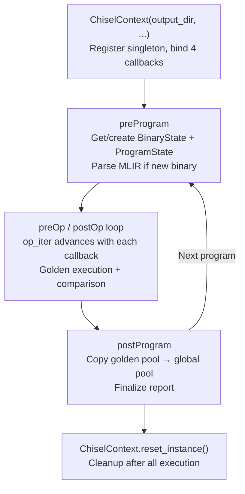
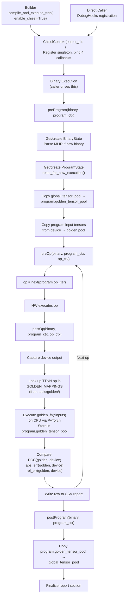
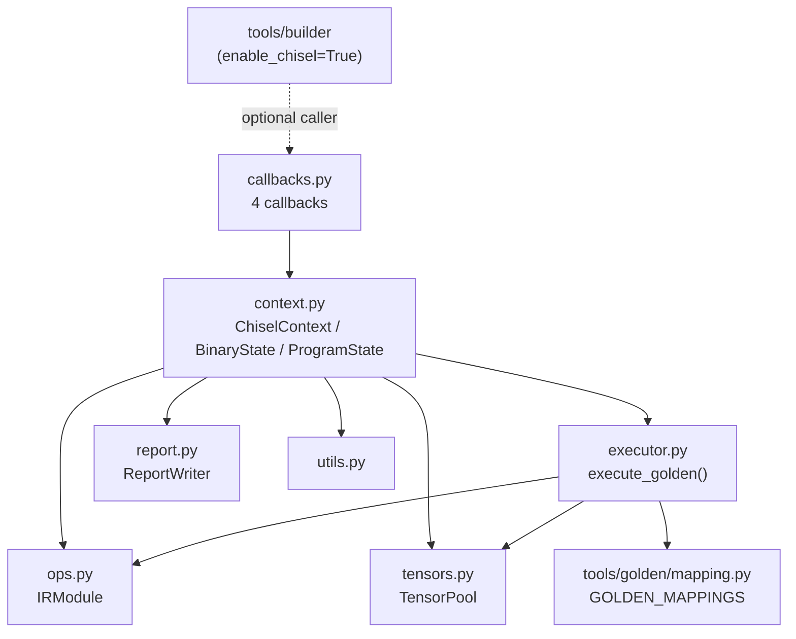
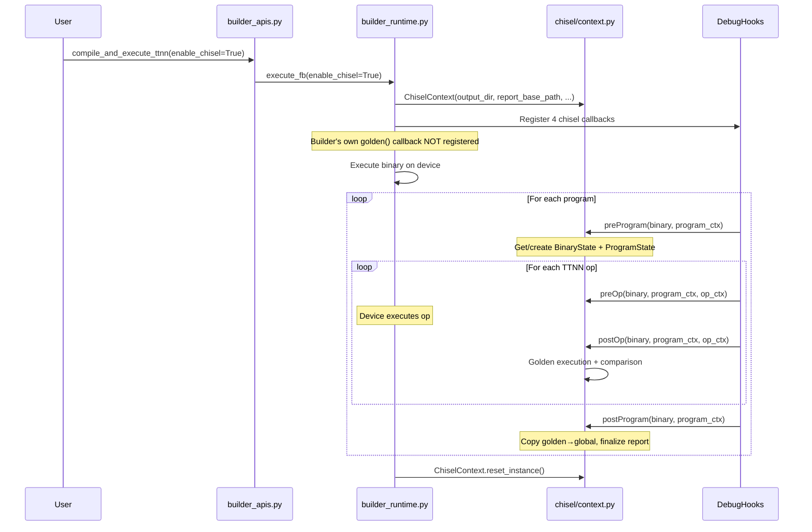

# Chisel: Architecture

## Module Structure

**PR 1 (Single Op Isolation):**
```
tools/chisel/
├── CMakeLists.txt
└── chisel/
    ├── __init__.py        # Package init
    ├── context.py         # Slim ChiselContext (ir_module, op_iter, stashed inputs)
    ├── callbacks.py       # preOp/postOp only (2 callbacks)
    ├── executor.py        # execute_golden(op, ir_module, inputs: dict)
    ├── ops.py             # IRModule wrapper for TTNN module
    └── utils.py           # Dtype maps, runtime tensor conversion
```

**PR 2+ (Full Architecture):**
```
tools/chisel/
├── CMakeLists.txt
└── chisel/
    ├── __init__.py        # Package init, exports ChiselContext accessors
    ├── context.py         # ChiselContext singleton, BinaryState, ProgramState
    ├── callbacks.py       # preProgram/postProgram/preOp/postOp callback functions
    ├── executor.py        # Golden execution + pool-aware wrapper
    ├── tensors.py         # TensorPool (stores GoldenMapTensor directly)
    ├── ops.py             # IRModule wrapper for TTNN module
    ├── report.py          # CSV report writer (PR 3)
    └── utils.py           # Dtype maps, runtime tensor conversion
```

## Isolation Mode (PR 1)

PR 1 uses a slim `ChiselContext` with only what's needed for per-op testing:

```
ChiselContext (singleton)
├── ir_module: IRModule              # parsed MLIR
├── op_iter: Iterator                # advances with preOp
├── _current_op: Operation | None    # set in preOp, used in postOp
└── _stashed_inputs: dict | None     # device inputs copied in preOp, consumed in postOp
```

**Callback flow per op:**
1. **preOp**: `_current_op = next(op_iter)`, copy device input tensors to host,
   stash in `_stashed_inputs`
2. **HW executes op**
3. **postOp**: Run golden with stashed inputs, capture device output, compare
   (PCC, atol, rtol), log to stdout, discard golden output

Each op is self-contained — no dependency on previous ops' golden outputs.
This mode validates that individual golden functions produce correct results
against device outputs.

## Hierarchical State Model (PR 2+)

PR 2 expands to a three-level hierarchy to manage state across binaries,
programs, and ops:

```
ChiselContext (singleton)
├── global_tensor_pool: TensorPool       # keyed by Tensor::globalId
│                                        # cross-binary AND cross-program sharing
├── binaries: Dict[binary_id, BinaryState]
├── current_binary: BinaryState | None
├── current_program: ProgramState | None
└── output_dir, report_base_path, caching config

BinaryState
├── ir_module: IRModule                  # parsed MLIR from binary.mlir.source
├── programs: Dict[program_index, ProgramState]
└── report: ReportWriter                 # per-binary CSV

ProgramState
├── golden_tensor_pool: TensorPool       # isolated per-program, keyed by SSA name
├── ops: List[OpInfo]                    # ordered ops for this program
├── op_iter: Iterator[OpInfo]            # advances with preop/postop callbacks
└── _skip_stash: dict[str, Tensor] | None  # preOp saves inputs here for skip mode
```

This eliminates heuristic-based program transition detection (`_op_index`
wrapping, `_current_binary_id` checks). The `preProgram` callback receives
explicit `binary.id` and `program_index`, so state lookup is direct.

### Lifecycle



### Design

```python
class ChiselContext:
    _instance: Optional["ChiselContext"] = None

    def __init__(self, output_dir, report_base_path, caching=True):
        ChiselContext._instance = self

        # Cross-binary/cross-program golden tensor sharing
        # Keyed by Tensor::globalId
        self.global_tensor_pool = TensorPool(...)

        # State per binary, created lazily on first preProgram
        self.binaries: Dict[int, BinaryState] = {}

        # Set by preProgram, used by preOp/postOp
        self.current_binary: BinaryState | None = None
        self.current_program: ProgramState | None = None

    @classmethod
    def get_instance(cls) -> "ChiselContext":
        if cls._instance is None:
            raise RuntimeError("ChiselContext not initialized")
        return cls._instance

    @classmethod
    def reset_instance(cls) -> None:
        cls._instance = None


class BinaryState:
    def __init__(self, binary):
        # Extract and parse TTNN MLIR from binary.mlir.source
        self.ir_module = IRModule(mlir_source=binary.mlir.source)
        self.programs: Dict[int, ProgramState] = {}
        self.report = ReportWriter(...)

    def get_or_create_program(self, program_index) -> "ProgramState":
        if program_index not in self.programs:
            self.programs[program_index] = ProgramState(program_index, self.ir_module)
        return self.programs[program_index]


class ProgramState:
    def __init__(self, program_index, ir_module: IRModule):
        self.program_index = program_index
        self.golden_tensor_pool = TensorPool(...)
        self.ops: List[OpInfo] = [...]  # ordered from ir_module
        self.op_iter: Iterator[OpInfo] = iter(self.ops)
        self._skip_stash: dict[str, Tensor] | None = None

    def reset_for_new_execution(self) -> None:
        """Called by preProgram on each program execution."""
        self.op_iter = iter(self.ops)     # Reset iterator
        self._skip_stash = None
        # golden_tensor_pool is NOT cleared — preserved across re-executions
```

Key properties:
- **No `run()` method** — Chisel does not drive execution
- **No `bind_callbacks()`** — the caller registers callbacks directly
- **MLIR from flatbuffer** — reads TTNN MLIR string from `TTNNBinary.mlir.source`
  on first `preProgram` for a given binary
- **No `_op_index`** — replaced by `ProgramState.op_iter`
- **No heuristic program detection** — `preProgram` provides explicit binary/program identity

## Data Flow



## Module Dependencies



## Component Descriptions

### `context.py` — Hierarchical Orchestrator

Contains three classes:
- **`ChiselContext`** — singleton entry point. Holds `global_tensor_pool`,
  `binaries` dict, and `current_binary`/`current_program` pointers. Implements
  `preprogram()`, `postprogram()`, `preop()`, `postop()` methods that manage
  the hierarchy and delegate to the appropriate `ProgramState`.
- **`BinaryState`** — per-binary state. Created on first `preProgram` for a
  given `binary.id`. Owns the `IRModule` and `ReportWriter`.
- **`ProgramState`** — per-program state. Created on first `preProgram` for a
  given `program_index`. Owns isolated `golden_tensor_pool`,
  and the `op_iter`.

### `callbacks.py` — Callback Functions

Thin module exporting four functions compatible with `DebugHooks`:

```python
def chisel_pre_program_callback(binary, program_context):
    ChiselContext.get_instance().preprogram(binary, program_context)

def chisel_post_program_callback(binary, program_context):
    ChiselContext.get_instance().postprogram(binary, program_context)

def chisel_pre_op_callback(binary, program_context, op_context):
    ChiselContext.get_instance().preop(binary, program_context, op_context)

def chisel_post_op_callback(binary, program_context, op_context):
    ChiselContext.get_instance().postop(binary, program_context, op_context)
```

### `executor.py` — Golden Execution

Provides golden execution functions:
- **`execute_golden(op, ir_module, inputs: dict)`** (PR 1) — core function that
  takes a plain dict of input tensors, looks up the op in `GOLDEN_MAPPINGS`,
  calls the golden function, and returns the result.
- **`execute_golden_from_pool(op, ir_module, tensor_pool)`** (PR 2) — pool-aware
  wrapper that retrieves inputs from `TensorPool`, calls the core function,
  and stores outputs back in the pool.

### `tensors.py` — Tensor Management

- **`TensorPool`**: Dict-based tensor store mapping keys to `GoldenMapTensor`
  directly, with optional disk caching. Multiple instances exist at different
  levels: `global_tensor_pool` on `ChiselContext` (keyed by `Tensor::globalId`)
  and per-`ProgramState` `golden_tensor_pool` (keyed by SSA value name).
  No `TensorValue` wrapper — `GoldenMapTensor` from `tools/golden/` already
  provides all needed tensor semantics (sharding, torch op compatibility,
  dtype conversion). Device tensors are ephemeral (read in callback, compared,
  discarded) and don't need pool storage.

### `ops.py` — IRModule Wrapper

Wraps an MLIR Module with caching and traversal utilities:
- Cached function lookups
- Cached operation lists per function
- AsmState management for efficient name/ASM lookups

### `report.py` — CSV Report Writer

Writes per-op comparison results to CSV with columns:
- Location (MLIR source location)
- Operation name/type
- Input/output tensor info
- PCC, absolute error, relative error
- Program index (for multi-program execution)

Scoped per-`BinaryState`. Supports per-program sections via `start_program()`.

### `utils.py` — Utilities

Consolidated utility module:
- **Dtype maps**: TTNN-to-PyTorch and TTRT-to-PyTorch dtype mappings
- **Debug utilities**: `@debug_wrap()` decorator for pdb integration

## Builder Integration

Chisel integrates with the builder (`tools/builder/`) as a first-class
execution path. The builder adds an `enable_chisel` parameter to
`execute_fb()` and `compile_and_execute_ttnn()`.

### Mutual Exclusivity

`enable_chisel` and `verify_intermediates` are **mutually exclusive**. When
`enable_chisel=True`:
- Builder's own `golden()` callback in `builder_runtime.py` is **not** registered
- Chisel's four callbacks are registered with `DebugHooks` instead
- Builder still handles compilation, flatbuffer generation, and execution —
  Chisel only handles the golden comparison

### Integration Flow



### Callback Signatures

Chisel uses two callback signatures:

- **Program-level**: `(binary, program_context)` — for `preProgram`/`postProgram`
- **Op-level**: `(binary, program_context, op_context)` — for `preOp`/`postOp`

These are compatible with `DebugHooks` and work whether the caller is builder,
ttrt, or any other runner.

### Runtime Helper Functions

The following standalone functions extract information from callback context
objects (bound via nanobind in `runtime/python/runtime/runtime.cpp`):

| Function | Signature | Purpose |
|----------|-----------|---------|
| `get_program_index` | `(CallbackContext) → int` | Returns the program index from the underlying `ProgramContext`. Used by `preProgram` to look up or create the correct `ProgramState`. |
| `get_program_input_ids` | `(CallbackContext) → list[int]` | Returns global IDs of program input tensors. Used by `preProgram` to copy input tensors from device into golden pool upfront. |
| `get_program_output_ids` | `(CallbackContext) → list[int]` | Returns global IDs of program output tensors. |
| `get_op_output_ref` | `(OpContext, CallbackContext) → TensorRef` | Returns a reference to the op's output tensor on device. |
| `get_op_input_refs` | `(OpContext, CallbackContext) → list[TensorRef]` | Returns references to the op's input tensors on device. |
| `retrieve_tensor_from_pool` | `(CallbackContext, TensorRef, bool) → Tensor` | Retrieves a tensor from the runtime tensor pool. |
| `update_tensor_in_pool` | `(CallbackContext, TensorRef, Tensor) → None` | Updates a tensor in the runtime tensor pool. |

## Comparison with Old Architecture

| Aspect | Old | New |
|--------|-----|-----|
| IR modules | Two: TTIR (golden) + TTNN (device) | One: TTNN (both) |
| State model | Flat singleton with `_op_index` | Hierarchical: ChiselContext → BinaryState → ProgramState |
| Program detection | Heuristic (`binary.id` change + `_op_index` wrapping) | Explicit via `preProgram` callback |
| Op tracking | Manual `_op_index` counter with reset | Iterator (`op_iter`) that advances with callbacks |
| Golden pool scope | Single global pool on ChiselContext | Per-program pool + global pool for cross-program sharing |
| Registry | Correlates ops across TTIR and TTNN by source location | Removed — IRModule handles op tracking directly |
| Fusion handling | `_merge_empty_golden_groups()` for TTIR/TTNN mismatches | Not needed — same ops in both paths |
| Golden execution | Custom TTIR op mappings with special-case handling | Reuses `tools/golden/GOLDEN_MAPPINGS` for TTNN ops via standalone `execute_golden()` |
| Compilation | `compile_pipeline.py` runs TTIR-to-TTNN passes | None — reads TTNN MLIR from flatbuffer's `TTNNBinary.mlir.source` |
| Input initialization | `generate_random_inputs()` / `load_inputs_from_disk()` | Inputs captured from runtime in preop callback |
| Execution driver | Chisel creates `RtApi.Run` and calls `rt_api()` | Passive observer — caller drives TTRT |
| CLI | `main.py` with argparse | None — library only |
| Packaging | `setup.py` + `pip install -e` | CMake `declare_mlir_python_sources()` |
| Callbacks | 2 (preop, postop) | 4 (preProgram, postProgram, preOp, postOp) |

### Files Removed

- `main.py` — CLI entry point
- `compile_pipeline.py` — TTIR-to-TTNN compilation
- `setup.py` — pip packaging
- `registry.py` — Registry and OpGroup (absorbed into IRModule)
- `enums.py` — `ExecutionType` enum (simplified or inlined)

### Files Added

- `callbacks.py` — standalone callback function module (4 callbacks)
