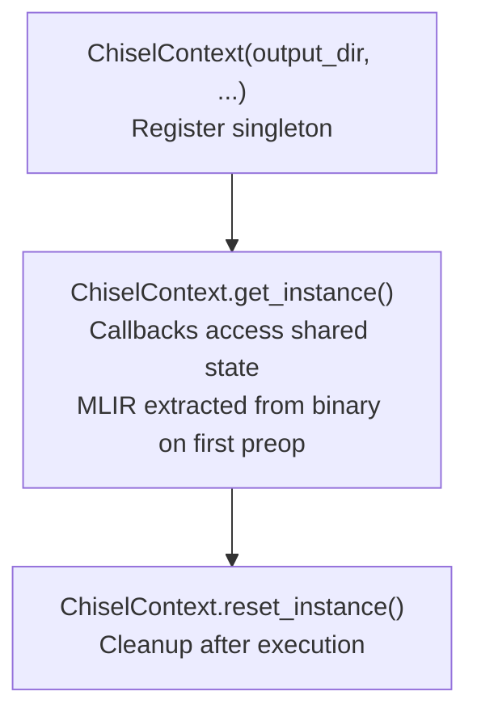
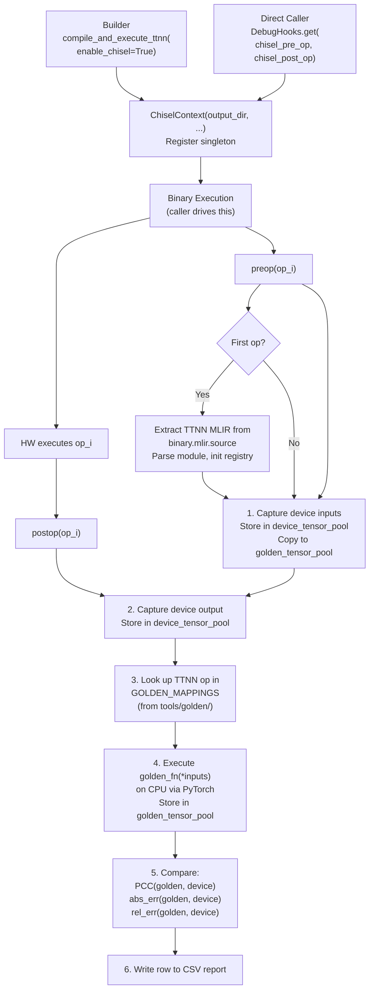
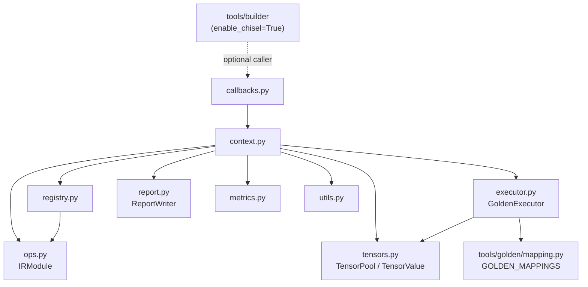
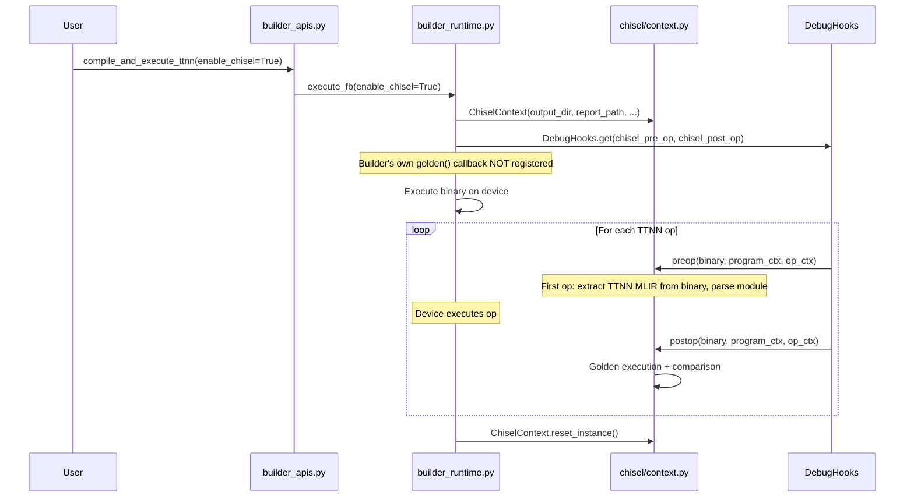

# Chisel: Architecture

## Module Structure

```
tools/chisel/
├── CMakeLists.txt
└── chisel/
    ├── __init__.py        # Package init, exports ChiselContext accessors
    ├── context.py         # ChiselContext singleton
    ├── callbacks.py       # preop/postop callback functions
    ├── executor.py        # Golden executor (TTNN ops on CPU via PyTorch)
    ├── registry.py        # TTNN op tracking and tensor registration
    ├── tensors.py         # TensorPool and TensorValue
    ├── ops.py             # IRModule wrapper for TTNN module
    ├── report.py          # CSV report writer
    ├── metrics.py         # PCC, absolute error, relative error
    └── utils.py           # Location parsing, dtype maps, debug utilities
```

## Singleton ChiselContext

`ChiselContext` uses a singleton pattern because the preop/postop callbacks
registered with `DebugHooks.get()` are plain functions — they need access to
shared state without being bound methods.

### Lifecycle



### Design

```python
class ChiselContext:
    _instance: Optional["ChiselContext"] = None

    def __init__(self, output_dir, report_path, ...):
        ChiselContext._instance = self

        # MLIR module initialized lazily on first preop callback
        self.device_ir_module: IRModule | None = None

        # Dual tensor pools
        self.golden_tensor_pool = TensorPool(...)
        self.device_tensor_pool = TensorPool(...)

        # Single-module registry
        self.registry = Registry(module=self.device_ir_module)

        # Golden executor reusing tools/golden/ GOLDEN_MAPPINGS
        self.executor = GoldenExecutor(self.registry, self.golden_tensor_pool)

        # Reporting
        self.report = ReportWriter(report_path)

    @classmethod
    def get_instance(cls) -> "ChiselContext":
        if cls._instance is None:
            raise RuntimeError("ChiselContext not initialized")
        return cls._instance

    @classmethod
    def reset_instance(cls) -> None:
        cls._instance = None
```

Key properties:
- **No `run()` method** — Chisel does not drive execution
- **No `bind_callbacks()`** — the caller registers callbacks directly
- **MLIR from flatbuffer** — reads TTNN MLIR string from `TTNNBinary.mlir.source` and parses it internally

## Data Flow



## Module Dependencies



## Component Descriptions

### `context.py` — Singleton Orchestrator

Central state management. Holds the TTNN module, both tensor pools, the
registry, executor, and report writer. Implements `preop()` and `postop()`
methods that the callback functions delegate to.

### `callbacks.py` — Callback Functions

Thin module exporting two functions compatible with `DebugHooks.get()`:

```python
def chisel_pre_op_callback(binary, program_context, op_context):
    ChiselContext.get_instance().preop(binary, program_context, op_context)

def chisel_post_op_callback(binary, program_context, op_context):
    ChiselContext.get_instance().postop(binary, program_context, op_context)
```

### `executor.py` — Golden Executor

Executes TTNN operations on CPU using `GOLDEN_MAPPINGS` from `tools/golden/mapping.py`.
For each TTNN op encountered during device execution, the executor:
1. Retrieves input tensors from `golden_tensor_pool`
2. Looks up the op type in `GOLDEN_MAPPINGS`
3. Calls the golden function with PyTorch tensors
4. Stores the result in `golden_tensor_pool`

### `registry.py` — Op Tracking

Tracks TTNN operations from a single module. Compared to the old chisel, this
is significantly simplified:
- **No dual-module correlation** — operates on one TTNN module
- **No fusion group merging** — both golden and device see the same ops
- Maps MLIR source locations to operations
- Tracks tensor names and their associations with operations

### `tensors.py` — Tensor Management

- **`TensorValue`**: Wraps tensor data with metadata (execution type, runtime
  reference, execution data).
- **`TensorPool`**: Dict-based tensor store with optional disk caching. Two
  pools exist: one for golden (CPU) tensors and one for device (hardware)
  tensors.

### `ops.py` — IRModule Wrapper

Wraps an MLIR Module with caching and traversal utilities:
- Cached function lookups
- Cached operation lists per function
- AsmState management for efficient name/ASM lookups
- Location-to-operation index mapping

### `report.py` — CSV Report Writer

Writes per-op comparison results to CSV with columns:
- Location (MLIR source location)
- Operation name/type
- Input/output tensor info
- PCC, absolute error, relative error

### `metrics.py` — Comparison Metrics

- `compute_pcc(golden, device)` — Pearson Correlation Coefficient
- `compute_abs_err(golden, device)` — Maximum absolute difference
- `compute_rel_err(golden, device)` — Maximum relative error
- Shape alignment utilities (squeeze, broadcast, permute, flatten) to handle
  minor layout differences between golden and device tensors

### `utils.py` — Utilities

Consolidated utility module:
- **Location parsing**: MLIR location to `(line, col)` tuple conversion
- **Dtype maps**: TTNN-to-PyTorch and TTRT-to-PyTorch dtype mappings
- **Debug utilities**: `@debug_wrap()` decorator for pdb integration

## Builder Integration

Chisel integrates with the builder (`tools/builder/`) as a first-class
execution path. The builder adds an `enable_chisel` parameter to
`execute_fb()` and `compile_and_execute_ttnn()`.

### Mutual Exclusivity

`enable_chisel` and `verify_intermediates` are **mutually exclusive**. When
`enable_chisel=True`:
- Builder's own `golden()` callback in `builder_runtime.py` is **not** registered
- Chisel's `chisel_pre_op_callback` / `chisel_post_op_callback` are registered
  with `DebugHooks.get()` instead
- Builder still handles compilation, flatbuffer generation, and execution —
  Chisel only handles the golden comparison

### Integration Flow



### Callback Signature

Chisel callbacks use the same `(binary, program_context, op_context)` signature
as builder's own callbacks. This makes them a drop-in replacement — no adapter
needed. The same callbacks work whether the caller is builder, ttrt, or any
other `DebugHooks`-based runner.

## Comparison with Old Architecture

| Aspect | Old | New |
|--------|-----|-----|
| IR modules | Two: TTIR (golden) + TTNN (device) | One: TTNN (both) |
| Registry | Correlates ops across TTIR and TTNN by source location | Tracks ops in single TTNN module |
| Fusion handling | `_merge_empty_golden_groups()` for TTIR/TTNN mismatches | Not needed — same ops in both paths |
| Golden executor | Custom TTIR op mappings with special-case handling | Reuses `tools/golden/GOLDEN_MAPPINGS` for TTNN ops |
| Compilation | `compile_pipeline.py` runs TTIR-to-TTNN passes | None — reads TTNN MLIR from flatbuffer's `TTNNBinary.mlir.source` |
| Input initialization | `generate_random_inputs()` / `load_inputs_from_disk()` | Inputs captured from runtime in preop callback |
| Execution driver | Chisel creates `RtApi.Run` and calls `rt_api()` | Passive observer — caller drives TTRT |
| `IRModule.execution_type` | `GOLDEN` or `DEVICE` enum per module | Removed — single module |
| CLI | `main.py` with argparse | None — library only |
| Packaging | `setup.py` + `pip install -e` | CMake `declare_mlir_python_sources()` |

### Files Removed

- `main.py` — CLI entry point
- `compile_pipeline.py` — TTIR-to-TTNN compilation
- `setup.py` — pip packaging
- `enums.py` — `ExecutionType` enum (simplified or inlined)

### Files Added

- `callbacks.py` — standalone callback function module
