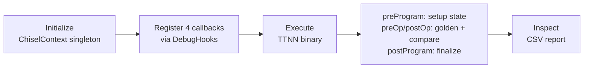

# Chisel: Feature Overview

## What is Chisel?

Chisel is a **differential debugging tool** for TT-MLIR that performs op-by-op
comparison between **golden** (CPU reference) and **device** (TT hardware)
execution — both at the **TTNN dialect level**.

For every TTNN operation executed on hardware, Chisel replays the same operation
on CPU using PyTorch-based golden reference implementations and computes
numerical accuracy metrics. This enables developers to pinpoint exactly which
hardware operation introduces numerical divergence.

## Key Capabilities

- **Op-by-op comparison**: Every TTNN op executed on device is independently
  compared against its golden CPU counterpart.
- **Accuracy metrics**: Per-op computation of:
  - **PCC** (Pearson Correlation Coefficient)
  - **Absolute error** (max absolute difference)
  - **Relative error** (max relative difference)
- **CSV reporting**: Structured per-op report with operation names, locations,
  input/output tensor info, and all accuracy metrics.
- **Tensor caching**: Optional disk-based caching of golden and device tensors
  for post-mortem analysis.
- **Callback-driven**: Integrates non-invasively into any execution flow
  (builder or direct `DebugHooks`) via four callbacks (preProgram, postProgram,
  preOp, postOp) — no separate CLI or execution pipeline required.
- **Multi-program execution**: Supports multiple programs per binary
  (e.g., forward + backward passes) and training loops via hierarchical state
  model (`ChiselContext → BinaryState → ProgramState`). Per-program golden and
  device tensor pools, iterator-based op tracking, and cross-program golden
  tensor sharing via `global_tensor_pool`.
- **Builder integration**: First-class support via `enable_chisel` parameter
  in the builder's `compile_and_execute_ttnn()` — mutually exclusive with
  builder's own `verify_intermediates` PCC checking.

## How It Works

Chisel operates as a **passive observer** during binary execution. It can be
used through two paths: **builder integration** (recommended) or **direct
callback registration**.



1. **Initialize** a `ChiselContext` singleton with output configuration.
2. **Register** Chisel's four callback functions (preProgram, postProgram,
   preOp, postOp) with `DebugHooks`.
3. **Execute** the TTNN flatbuffer binary (via builder or any other runner).
4. For each program, `preProgram` creates/finds `BinaryState` and
   `ProgramState`, then for each TTNN op:
   - `preOp`: advance `op_iter`, capture device inputs, copy to golden pool
   - Device executes op
   - `postOp`: capture device output, replay on CPU, compare, write report
5. `postProgram` copies golden tensors to `global_tensor_pool` for cross-program
   sharing.
6. **Inspect** the generated CSV report.

### Usage: Builder Integration (Recommended)

The simplest way to use Chisel is through the builder's `enable_chisel`
parameter. This is **mutually exclusive** with builder's own
`verify_intermediates` — when `enable_chisel=True`, builder delegates all
golden verification to Chisel instead of using its own PCC checking.

```python
from builder.base.builder_apis import compile_and_execute_ttnn

def module(builder: TTNNBuilder):
    @builder.func([(32, 32)], [torch.float32])
    def func(in0: Operand, builder: TTNNBuilder):
        return builder.sigmoid(in0)

# Builder handles ChiselContext init, callback registration, and cleanup
compile_and_execute_ttnn(
    module,
    device=device,
    enable_chisel=True,           # Activates Chisel (exclusive with verify_intermediates)
    chisel_output_dir="./output",
    chisel_report_path="./report.csv",
)
```

### Usage: Direct Callback Registration

For integration outside the builder (e.g., custom runners), register callbacks
manually:

```python
from chisel.context import ChiselContext
from chisel.callbacks import (
    chisel_pre_program_callback,
    chisel_post_program_callback,
    chisel_pre_op_callback,
    chisel_post_op_callback,
)
import ttrt.runtime

# Initialize the singleton context
ctx = ChiselContext(
    output_dir=Path("./chisel_output"),
    report_base_path=Path("./chisel_report.csv"),
)

# Register all 4 callbacks
# preProgram/postProgram handle state setup/teardown per program
# preOp/postOp handle golden comparison per operation
ttrt.runtime.DebugHooks.register(
    pre_program=chisel_pre_program_callback,
    post_program=chisel_post_program_callback,
    pre_op=chisel_pre_op_callback,
    post_op=chisel_post_op_callback,
)

# Execute the binary — Chisel observes via callbacks
# ... run through any execution engine ...

# Cleanup
ChiselContext.reset_instance()
```

## Multi-Program Execution

Chisel supports multiple programs per binary (e.g., forward + backward passes),
repeated execution of the same program (training loops), and multiple binaries
in the same process (tt-xla flows). This is handled by the hierarchical state
model: `ChiselContext → BinaryState → ProgramState`.

### Hierarchical State

- **`ChiselContext`** holds a `global_tensor_pool` (keyed by `Tensor::globalId`)
  and a `binaries` dict mapping `binary.id` to `BinaryState`.
- **`BinaryState`** is created once per binary. Holds the parsed `IRModule`,
  `Registry`, `ReportWriter`, and a `programs` dict mapping `program_index` to
  `ProgramState`.
- **`ProgramState`** is created once per program. Holds isolated
  `golden_tensor_pool` and `device_tensor_pool`, a `GoldenExecutor`, and an
  `op_iter` that advances with each preOp/postOp callback.

### Program Boundaries

Program boundaries are explicit — `preProgram(binary, program_context)` fires
at the start of each program execution with the `binary.id` and
`program_index`. No heuristic detection is needed.

### State Lifecycle

On each `preProgram` call, `ProgramState.reset_for_new_execution()`:
- Clears `device_tensor_pool` (stale `TensorRef`s from previous execution)
- Resets `op_iter` to the beginning of the ops list
- Preserves `golden_tensor_pool` (pure CPU tensors, no device dependency)

| State | On re-execution | On new binary |
|-------|:--------------:|:-------------:|
| `ProgramState.device_tensor_pool` | Cleared | N/A (new state) |
| `ProgramState.golden_tensor_pool` | Preserved | N/A (new state) |
| `ProgramState.op_iter` | Reset | N/A (new state) |
| `BinaryState.ir_module` | Preserved | New |
| `BinaryState.registry` | Preserved | New |
| `ChiselContext.global_tensor_pool` | Preserved | Preserved |

### Golden Tensor Sharing

Golden tensors flow through a two-level pool system:

1. **Per-program pool** (keyed by SSA name): Used during op execution within a
   program. The `GoldenExecutor` reads inputs from and writes outputs to this
   pool.
2. **Global pool** (keyed by `Tensor::globalId`): Cross-program and cross-binary
   sharing hub. `postProgram` copies new golden tensors from program → global.
   `preProgram` copies matching tensors from global → program.

This enables:
- **Shared weights**: Forward pass golden weights flow through the global pool
  to the backward pass's program pool.
- **Output-to-input chaining**: Program 0's golden output for `%5` is stored
  in the global pool, then copied into program 1's pool when it takes `%5`
  as input.
- **Re-execution warm cache**: Same program re-runs find their
  `golden_tensor_pool` already populated from the previous iteration.

### Different Binary Handling

Different binaries are naturally separate `BinaryState` entries in
`ctx.binaries`. When `preProgram` encounters a new `binary.id`, it creates a
new `BinaryState` — parsing the MLIR, building the registry, etc. No
`module_provider` callback or `ChiselContext` recreation needed.

The `global_tensor_pool` is preserved across binary boundaries, enabling
cross-binary golden tensor sharing via `Tensor::globalId`.

### Per-Program Reporting

The `ReportWriter` (scoped per-`BinaryState`) supports per-program sections
via `start_program(program_index)`. Each program's ops are grouped under a
`program_index` column in the CSV output.

## What Changed From the Previous Chisel

| Aspect | Old Chisel | New Chisel |
|--------|-----------|------------|
| Location | `runtime/tools/chisel/` | `tools/chisel/` |
| Comparison level | TTIR (golden) vs TTNN (device) | TTNN (golden) vs TTNN (device) |
| Entry point | CLI via `main.py` with argparse | Library only — callback functions |
| Compilation | Chisel ran its own TTIR-to-TTNN pass pipeline | None — reads TTNN MLIR from flatbuffer |
| Execution | Chisel drove TTRT execution via `RtApi` | Passive — observes via callbacks |
| State model | Flat singleton with `_op_index` counter | Hierarchical: ChiselContext → BinaryState → ProgramState |
| Op tracking | Manual `_op_index` with reset heuristics | Iterator (`op_iter`) advancing with callbacks |
| Callbacks | 2 (preop, postop) | 4 (preProgram, postProgram, preOp, postOp) |
| Golden executor | Custom PyTorch mappings for TTIR ops | Reuses `tools/golden/GOLDEN_MAPPINGS` for TTNN ops |
| Golden pool scope | Single global pool | Per-program pool + global pool for cross-program sharing |
| Packaging | `setup.py` with `pip install -e` | CMake `declare_mlir_python_sources()` |
| Multi-program | Single program only | Explicit program boundaries, per-program state, cross-program/cross-binary golden sharing |

### Why TTNN-Level Comparison?

The old approach compared TTIR (high-level) ops against TTNN (low-level) device
ops. This required a complex Registry to correlate ops across two different IR
representations, handle op fusion mismatches, and merge groups where TTIR ops
had no direct TTNN counterpart.

By comparing at the same TTNN level, the architecture is significantly
simplified:
- **One IR module** instead of two
- **Direct 1:1 op correspondence** — no cross-dialect correlation needed
- **No fusion mismatch handling** — both golden and device see the same ops
- **Reuse of existing golden mappings** from `tools/golden/`
