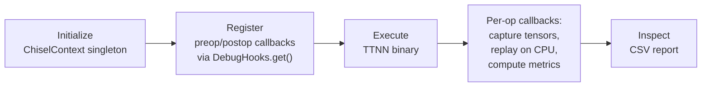

# Chisel: Feature Overview

## What is Chisel?

Chisel is a **differential debugging tool** for TT-MLIR that performs op-by-op
comparison between **golden** (CPU reference) and **device** (TT hardware)
execution — both at the **TTNN dialect level**.

For every TTNN operation executed on hardware, Chisel replays the same operation
on CPU using PyTorch-based golden reference implementations and computes
numerical accuracy metrics. This enables developers to pinpoint exactly which
hardware operation introduces numerical divergence.

## Key Capabilities

- **Op-by-op comparison**: Every TTNN op executed on device is independently
  compared against its golden CPU counterpart.
- **Accuracy metrics**: Per-op computation of:
  - **PCC** (Pearson Correlation Coefficient)
  - **Absolute error** (max absolute difference)
  - **Relative error** (max relative difference)
- **CSV reporting**: Structured per-op report with operation names, locations,
  input/output tensor info, and all accuracy metrics.
- **Tensor caching**: Optional disk-based caching of golden and device tensors
  for post-mortem analysis.
- **Callback-driven**: Integrates non-invasively into any execution flow
  (builder or direct `DebugHooks`) via preop/postop callbacks — no separate CLI
  or execution pipeline required.
- **Multi-program execution**: Supports multiple programs per binary
  (e.g., forward + backward passes) and training loops with automatic program
  transition detection via `Binary.id`, asymmetric state reset (device tensors
  cleared, golden tensors preserved), and cross-program golden tensor sharing.
- **Builder integration**: First-class support via `enable_chisel` parameter
  in the builder's `compile_and_execute_ttnn()` — mutually exclusive with
  builder's own `verify_intermediates` PCC checking.

## How It Works

Chisel operates as a **passive observer** during binary execution. It can be
used through two paths: **builder integration** (recommended) or **direct
callback registration**.



1. **Initialize** a `ChiselContext` singleton with the TTNN MLIR module and
   output configuration.
2. **Register** Chisel's preop/postop callback functions with
   `DebugHooks.get()`.
3. **Execute** the TTNN flatbuffer binary (via builder or any other runner).
4. For each TTNN op, Chisel's callbacks automatically:
   - Capture device input/output tensors
   - Replay the op on CPU using golden reference implementations from
     `tools/golden/`
   - Compute and record accuracy metrics
5. **Inspect** the generated CSV report.

### Usage: Builder Integration (Recommended)

The simplest way to use Chisel is through the builder's `enable_chisel`
parameter. This is **mutually exclusive** with builder's own
`verify_intermediates` — when `enable_chisel=True`, builder delegates all
golden verification to Chisel instead of using its own PCC checking.

```python
from builder.base.builder_apis import compile_and_execute_ttnn

def module(builder: TTNNBuilder):
    @builder.func([(32, 32)], [torch.float32])
    def func(in0: Operand, builder: TTNNBuilder):
        return builder.sigmoid(in0)

# Builder handles ChiselContext init, callback registration, and cleanup
compile_and_execute_ttnn(
    module,
    device=device,
    enable_chisel=True,           # Activates Chisel (exclusive with verify_intermediates)
    chisel_output_dir="./output",
    chisel_report_path="./report.csv",
)
```

### Usage: Direct Callback Registration

For integration outside the builder (e.g., custom runners), register callbacks
manually:

```python
from chisel.context import ChiselContext
from chisel.callbacks import chisel_pre_op_callback, chisel_post_op_callback
import ttrt.runtime

# Initialize the singleton context
ctx = ChiselContext(
    ttnn_module=module,
    output_dir=Path("./chisel_output"),
    report_path=Path("./chisel_report.csv"),
)

# Register callbacks — same signature works with any DebugHooks caller
debug_hooks = ttrt.runtime.DebugHooks.get(
    chisel_pre_op_callback,
    chisel_post_op_callback,
)

# Execute the binary — Chisel observes via callbacks
# ... run through any execution engine ...

# Cleanup
ChiselContext.reset_instance()
```

## Multi-Program Execution

Chisel supports multiple programs per binary (e.g., forward + backward passes)
and repeated execution of the same program (training loops). This requires
handling three concerns: stale device tensors, program transition detection,
and cross-program golden tensor reuse.

### Program Transition Detection

Chisel detects program boundaries using two mechanisms:

- **Different binary**: The `Binary.id` property (exposed from C++ via Python
  bindings) is a process-scoped monotonically increasing counter. When
  `binary.id` changes between callbacks, a new binary is executing.
- **Same-binary re-execution**: Since `ProgramContext` is opaque in Python,
  Chisel tracks the op counter. When all ops in the registry have been
  processed and `preop` fires again, a new program execution has started.

### Asymmetric State Reset

On program transition, Chisel performs an **asymmetric reset** — device state
is cleared while golden state is preserved:

| State | Reset | Preserved | Reason |
|-------|:-----:|:---------:|--------|
| `device_tensor_pool` | Yes | | `TensorRef`/`DeviceHandle` objects are tied to the destroyed `ProgramContext` |
| `golden_tensor_pool` | | Yes | Pure CPU/PyTorch tensors with no device dependency |
| `device_ir_module` | | Yes | Same MLIR module for the same binary |
| `registry` | | Yes | Op groups derived from module |
| `executor` | | Yes | References registry + golden pool |
| `_op_index` | Yes | | Reset for new program |
| `report` section | Yes | | New program gets a new report section |

### Golden Tensor Sharing Across Programs

Preserving the golden tensor pool across program boundaries enables three
scenarios:

1. **Shared weights**: Forward and backward passes use the same model weights.
   Golden weight tensors computed in program 0 are found in the pool by name
   when program 1 looks them up — no recomputation needed.
2. **Output-to-input chaining**: If program 0 produces a golden output for
   tensor `%5` and program 1 takes `%5` as input, the golden value is already
   available from program 0's postop.
3. **Re-execution warm cache**: When the same program re-runs in a training
   loop, golden tensors from the previous iteration serve as a warm cache for
   unchanged inputs.

Tensor names are derived from MLIR SSA values in the TTNN module. Since all
programs in the same binary share the same module, names for shared weights and
inter-program connections are identical. If a later program produces a tensor
with the same name but different values, the pool entry is overwritten in
postop (latest golden wins).

### Different Binary Handling

When `binary.id` changes, the TTNN MLIR module is different and `IRModule` and
`Registry` must be rebuilt. Two approaches:

- **`module_provider` callback**: An optional `Callable[[Binary], Module]`
  provided at init time. When a new binary is detected, Chisel calls it to
  obtain the new module and rebuilds internal state automatically.
- **Caller re-creates `ChiselContext`**: The builder already creates/destroys
  `ChiselContext` per `execute_fb()` call, so different binaries are handled
  naturally.

### Per-Program Reporting

The report writer supports per-program sections via `start_program()`. Each
program's ops are grouped under a `program_index` column in the CSV output,
keeping multi-program results organized in a single file.

## What Changed From the Previous Chisel

| Aspect | Old Chisel | New Chisel |
|--------|-----------|------------|
| Location | `runtime/tools/chisel/` | `tools/chisel/` |
| Comparison level | TTIR (golden) vs TTNN (device) | TTNN (golden) vs TTNN (device) |
| Entry point | CLI via `main.py` with argparse | Library only — callback functions |
| Compilation | Chisel ran its own TTIR-to-TTNN pass pipeline | None — receives pre-compiled TTNN module |
| Execution | Chisel drove TTRT execution via `RtApi` | Passive — observes via callbacks |
| Context pattern | Single-use object created in `main()` | Singleton accessed by callbacks |
| Golden executor | Custom PyTorch mappings for TTIR ops | Reuses `tools/golden/GOLDEN_MAPPINGS` for TTNN ops |
| Packaging | `setup.py` with `pip install -e` | CMake `declare_mlir_python_sources()` |
| Multi-program | Single program only | Automatic transition detection, asymmetric reset, cross-program golden sharing |

### Why TTNN-Level Comparison?

The old approach compared TTIR (high-level) ops against TTNN (low-level) device
ops. This required a complex Registry to correlate ops across two different IR
representations, handle op fusion mismatches, and merge groups where TTIR ops
had no direct TTNN counterpart.

By comparing at the same TTNN level, the architecture is significantly
simplified:
- **One IR module** instead of two
- **Direct 1:1 op correspondence** — no cross-dialect correlation needed
- **No fusion mismatch handling** — both golden and device see the same ops
- **Reuse of existing golden mappings** from `tools/golden/`
