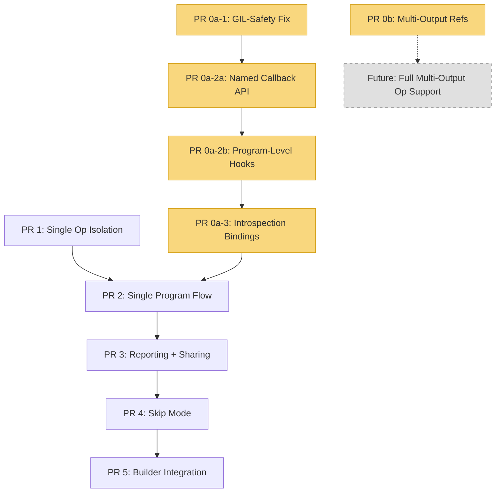

# Chisel Implementation Plan

## Overview

This document describes the implementation plan for the new Chisel tool, split
into 5 runtime PRs (0a-1, 0a-2a, 0a-2b, 0a-3, 0b), 1 metrics PR (0c), and
5 Chisel PRs (1-5). The runtime PRs form a dependency chain
(0a-1 → 0a-2a → 0a-2b → 0a-3) to keep each PR small and independently
testable. PR 0b is independent. Chisel PR 1 has **no runtime PR
prerequisites** — it uses existing runtime APIs (`DebugHooks.get()`,
`get_op_input_refs()`, `get_op_output_ref()`, `retrieve_tensor_from_pool()`)
and includes `tools/golden/metrics.py` directly. All 0a-* PRs must land
before Chisel PR 2 (program-level callbacks and introspection).

## Key Design Decisions

1. **Single TTNN module** — Both golden (CPU) and device execution operate on
   the same TTNN IR. No TTIR/TTNN cross-dialect correlation needed.
2. **TTNN MLIR from flatbuffer** — Chisel reads the TTNN MLIR text string
   directly from the flatbuffer binary's `TTNNBinary.mlir.source` field
   (always populated, plain MLIR text with debug info/locations) and parses
   it internally. No separate module passing needed.
3. **Fail hard on unmapped ops** — If a TTNN op has no golden implementation in
   `GOLDEN_MAPPINGS`, raise an error immediately rather than skipping.
   <!-- COMM: I would love that when first flatbuffer is accessed we get some way to go through it and check if we know to execute the whole flatbuffer to not have a case where it fails after 90% of runtime execution -->
4. **Singleton `ChiselContext`** — Required because `DebugHooks` callbacks are
   plain functions that need access to shared state.
5. **Passive observer** — Chisel does not drive execution. The caller (builder
   or direct user) registers callbacks and runs the binary.
6. **Reuse `tools/golden/GOLDEN_MAPPINGS`** — ~66 TTNN ops already have golden
   implementations. No new mapping layer needed.
7. **Unified metrics in `tools/golden/metrics.py`** — PCC, atol, rtol, and
   full comparison metrics live in `tools/golden/metrics.py` as a single
   canonical module. Builder, chisel, and ttrt all import from there instead
   of maintaining separate copies. Pure torch implementation (no numpy).

## PR Dependency Graph

- **PR 1** (Single Op Isolation) has **no runtime PR prerequisites**. It uses
  the existing `DebugHooks.get(pre, post)` API directly and includes
  `tools/golden/metrics.py` (previously PR 0c) within the PR itself. Builder
  integration uses `elif` for mutual exclusivity, so no named multi-client
  callback system is needed.
- **PR 0a-1** (GIL fix) is minimal and safe — no API change, just const ref
  returns and move semantics. Can merge quickly.
- **PR 0a-2a** (named callback API) refactors the `DebugHooks` API to support
  named multi-client registration. Migrates all existing callers (ttrt, builder,
  test). Depends on PR 0a-1.
- **PR 0a-2b** (program hooks) adds `preProgram`/`postProgram` to `CallbackSet`
  and `runProgramCallbacks()` in the executor. Depends on PR 0a-2a.
- **PR 0a-3** (introspection bindings) adds `get_program_index`,
  `get_program_input_refs`, `get_program_output_refs`, `Tensor.global_id`, and
  `Binary.id`. Depends on PR 0a-2b (needs program callbacks to test).
- **All 0a-* PRs** must land before **Chisel PR 2** — that's where Chisel
  registers program-level Python callbacks and queries program metadata.
- **PR 0c** (Unified Metrics) is included directly in **Chisel PR 1** —
  `tools/golden/metrics.py` is created there, not as a separate prerequisite.
- **PR 0b** is independent and not required for the initial integration.
  Multi-output ops (SortOp, MaxPool2dWithIndicesOp, etc.) will simply be
  unsupported until PR 0b lands. Chisel can skip them gracefully.

## PR Summary Table

| PR | Title | Scope | Tests | Depends On |
|----|-------|-------|-------|------------|
| 0a-1 | GIL-Safety Fix | const ref returns + move semantics in debug.h, debug.cpp, program_executor.cpp | Existing runtime tests pass (no behavioral change) | None |
| 0a-2a | Named Callback API | `setCallbacks(name, ...)`, callback map, migrate callers | Multi-client registration test, existing tests pass after migration | PR 0a-1 |
| 0a-2b | Program-Level Hooks | `preProgram`/`postProgram` in CallbackSet, `runProgramCallbacks()` | All 4 hooks fire in correct order test | PR 0a-2a |
| 0a-3 | Introspection Bindings | `get_program_index`, `get_program_input/output_refs`, `Tensor.global_id`, `Binary.id` | Python test querying program metadata from callbacks | PR 0a-2b |
| 0b | Multi-Output Refs | `getOpOutputRef` → `vector<TensorRef>` | Multi-output op extraction tests | None (independent) |
| 0c | Unified Metrics | `tools/golden/metrics.py`, migrate builder + ttrt | test/python/golden/test_metrics.py | None (included in Chisel PR 1) |
| 1 | Single Op Isolation | CMakeLists.txt, `__init__.py`, ops.py, executor.py, context.py (slim), callbacks.py (preOp/postOp), utils.py | test_ops.py, test_executor.py, test_context.py, test_callbacks.py, test_utils.py | None |
| 2 | Single Program Flow | tensors.py, context.py (full hierarchy), callbacks.py (4 callbacks), executor.py (pool-aware) | test_tensors.py, test_context.py (hierarchy), test_callbacks.py | PR 1, PR 0a-2b, PR 0a-3 |
| 3 | Reporting + Cross-Program Sharing | report.py, global_tensor_pool, disk caching | test_report.py, test_tensors.py (caching), test_context.py (cross-program) | PR 2 |
| 4 | Skip Mode | skip stash in preOp, golden replace in postOp | test_skip_mode.py | PR 3 |
| 5 | Builder Integration | (modifies builder_runtime.py, builder_apis.py) | test_builder_integration.py | PR 4 |

## Runtime PRs

### PR 0a-1: GIL-Safety Fix ([detail](pr0a_hooks_refactor.md))

Fix `debug::Hooks` so callbacks are never copied. Return by `const&`, accept
by rvalue ref + `std::move`. No API change — all existing callers work as-is.

**Files:** `runtime/include/tt/runtime/debug.h`, `runtime/lib/common/debug.cpp`,
`runtime/lib/ttnn/program_executor.cpp`

**Test:** Existing runtime tests pass unchanged.

### PR 0a-2a: Named Callback API ([detail](pr0a2a_named_callback_api.md))

Replace `Hooks::get(pre, post)` with `Hooks::get()` + `setCallbacks(name, CallbackSet)`.
Store callbacks in `unordered_map<string, CallbackSet>`. Migrate all existing
callers (ttrt, builder, test) to the new API. `CallbackSet` initially has only
`preOp`/`postOp` fields.

**Files:** `runtime/include/tt/runtime/debug.h`, `runtime/lib/common/debug.cpp`,
`runtime/include/tt/runtime/detail/ttnn/program_executor.h`,
`runtime/lib/ttnn/program_executor.cpp`, `runtime/python/runtime/runtime.cpp`,
`tools/ttrt/common/run.py`, `tools/builder/base/builder_runtime.py`,
`runtime/test/ttnn/python/n150/test_intermidate_tensor_manipulation.py`

**Test:** Multi-client registration, unregister by name, existing tests pass
after caller migration.

### PR 0a-2b: Program-Level Hooks ([detail](pr0a2b_program_level_hooks.md))

Add `ProgramCallbackFn` type and `preProgram`/`postProgram` fields to
`CallbackSet`. Add `runProgramCallbacks()` in `ProgramExecutor`. Expose
`pre_program`/`post_program` kwargs in Python `set_callbacks()`.

**Files:** `runtime/include/tt/runtime/debug.h`,
`runtime/include/tt/runtime/detail/ttnn/program_executor.h`,
`runtime/lib/ttnn/program_executor.cpp`, `runtime/python/runtime/runtime.cpp`

**Test:** All 4 hooks fire in correct order: pre-program → (pre-op → op →
post-op)* → post-program.

### PR 0a-3: Program Introspection Bindings ([detail](pr0a_program_input_output_refs.md))

Add Python bindings for querying program metadata from callbacks:
`get_program_index(CallbackContext)`, `get_program_input_refs(CallbackContext)`,
`get_program_output_refs(CallbackContext)`, `Tensor.global_id` property,
`Binary.id` property.

**Files:** `runtime/include/tt/runtime/runtime.h`,
`runtime/include/tt/runtime/detail/ttnn/ttnn.h`,
`runtime/include/tt/runtime/detail/ttmetal/ttmetal.h`,
`runtime/lib/runtime.cpp`, `runtime/lib/ttnn/runtime.cpp`,
`runtime/lib/ttmetal/runtime.cpp`, `runtime/python/runtime/runtime.cpp`,
`runtime/python/binary/binary.cpp`, `runtime/python/runtime/stubs_macos.cpp`

**Test:** Python test registering program callbacks and querying
`get_program_index()`, `get_program_input_refs()`, `get_program_output_refs()`,
`Binary.id`, `Tensor.global_id`.

**All 0a-* PRs must land before Chisel PR 2.** They are not prerequisites
for Chisel PR 1, which uses the existing runtime APIs directly.

### PR 0b: Multi-Output Refs ([detail](pr0b_multi_output_ref.md))

Change `getOpOutputRef` in `runtime/lib/ttnn/runtime.cpp` to return
`std::vector<TensorRef>` instead of `std::optional<TensorRef>`. Ops like
`SortOp`, `MaxPool2dWithIndicesOp`, `BatchNormTrainingOp` produce multiple
outputs but currently return `std::nullopt`.

**Not required for initial integration.** Without this, Chisel simply skips
multi-output ops. Can land at any time to extend coverage.

### PR 0c: Unified Metrics ([detail](pr0c_unified_metrics.md))

Consolidate 3 duplicate PCC/comparison implementations into a single
`tools/golden/metrics.py` module:
- `tools/builder/base/builder_runtime.py` — `get_atol_rtol_pcc()`, `check_outputs()` (numpy-based)
- `tools/ttrt/common/util.py` — near-identical copy with logging + message string
- `runtime/tools/chisel/chisel/utils/metrics.py` — pure torch

The unified module uses pure torch (no numpy), exposes `compute_pcc()`,
`compute_atol()`, `compute_rtol()`, and `compute_metrics()`.
Builder's `check_outputs()` keeps its signature but delegates internally.

Included in Chisel PR 1 — `tools/golden/metrics.py` is created there directly.

## Key Reference Files

| File | What It Provides |
|------|--------------------|
| `tools/golden/mapping.py` | `GOLDEN_MAPPINGS` dict (~66 TTNN ops), `get_golden_function()`, `GoldenMapTensor` |
| `tools/golden/metrics.py` | Unified PCC/atol/rtol/metrics — single source for builder, chisel, ttrt |
| `tools/builder/base/builder_runtime.py` | `execute_fb()`, `DebugHooks.get()`, `CallbackRuntimeConfig`, callback signatures |
| `tools/builder/base/builder_apis.py` | `compile_and_execute_ttnn()` / `_compile_and_execute()` |
| `tools/golden/CMakeLists.txt` | CMake packaging pattern to follow |
| `runtime/tools/chisel/chisel/core/` | Old chisel code to port from |
| `runtime/tools/chisel/chisel/utils/` | Old utilities to port from |

## Comparison with Old Architecture

| Aspect | Old (`runtime/tools/chisel/`) | New (`tools/chisel/`) |
|--------|-------------------------------|----------------------|
| IR modules | Two: TTIR (golden) + TTNN (device) | One: TTNN (both) |
| Registry | Correlates ops across TTIR/TTNN by location | Removed — IRModule tracks ops directly |
| Fusion handling | `_merge_empty_golden_groups()` | Not needed |
| Golden execution | Custom TTIR op mappings | Reuses `GOLDEN_MAPPINGS` TTNN entries via standalone `execute_golden()` |
| Compilation | `compile_pipeline.py` runs passes | None — reads TTNN MLIR from flatbuffer |
| Execution driver | Chisel creates and calls `rt_api()` | Passive — caller drives TTRT |
| CLI | `main.py` with argparse | None — library only |
| Packaging | `setup.py` + `pip install -e` | CMake `declare_mlir_python_sources()` |
