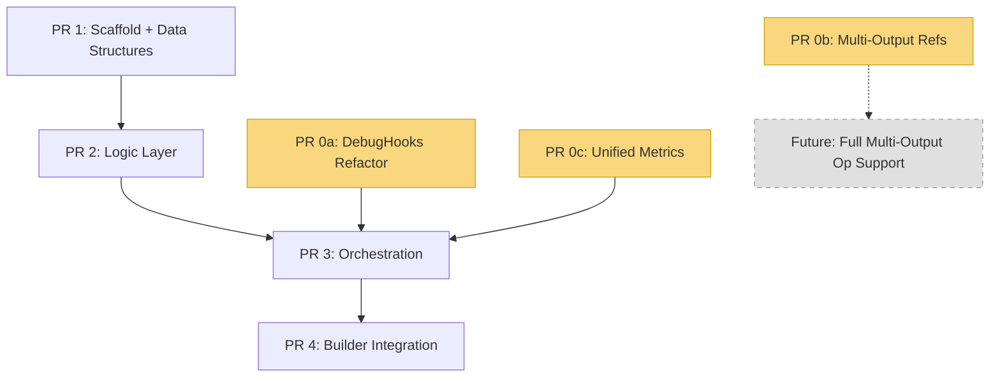

# Chisel Implementation Plan

## Overview

This document describes the implementation plan for the new Chisel tool, split
into 6 PRs: 2 runtime improvements (PR 0a, 0b) and 4 Chisel PRs (PR 1-4).
Each PR can be merged independently. The runtime PRs are not hard blockers for
the initial Chisel integration — they improve robustness and coverage but Chisel
works without them for the common single-output op case.

## Key Design Decisions

1. **Single TTNN module** — Both golden (CPU) and device execution operate on
   the same TTNN IR. No TTIR/TTNN cross-dialect correlation needed.
2. **TTNN MLIR from flatbuffer** — Chisel reads the TTNN MLIR text string
   directly from the flatbuffer binary's `TTNNBinary.mlir.source` field
   (always populated, plain MLIR text with debug info/locations) and parses
   it internally. No separate module passing needed.
3. **Fail hard on unmapped ops** — If a TTNN op has no golden implementation in
   `GOLDEN_MAPPINGS`, raise an error immediately rather than skipping.
   <!-- COMM: I would love that when first flatbuffer is accessed we get some way to go through it and check if we know to execute the whole flatbuffer to not have a case where it fails after 90% of runtime execution -->
4. **Singleton `ChiselContext`** — Required because `DebugHooks` callbacks are
   plain functions that need access to shared state.
5. **Passive observer** — Chisel does not drive execution. The caller (builder
   or direct user) registers callbacks and runs the binary.
6. **Reuse `tools/golden/GOLDEN_MAPPINGS`** — ~66 TTNN ops already have golden
   implementations. No new mapping layer needed.
7. **Unified metrics in `tools/golden/metrics.py`** — PCC, atol, rtol, and
   full comparison metrics live in `tools/golden/metrics.py` as a single
   canonical module. Builder, chisel, and ttrt all import from there instead
   of maintaining separate copies. Pure torch implementation (no numpy).

## PR Dependency Graph

- **PRs 1-2** have no runtime dependencies — pure Python with no callback
  registration, so the DebugHooks copy bug doesn't affect them.
- **PR 0a** must land before **PR 3** — that's where callbacks get registered
  and invoked, hitting the copy/GIL bug in tt-xla.
- **PR 0c** must land before **PR 3** — PR 3's `context.py` imports comparison
  functions from `golden.metrics`. PR 0c also migrates builder/ttrt duplicates.
  Can be developed in parallel with PRs 1-2.
- **PR 0b** is independent and not required for the initial integration.
  Multi-output ops (SortOp, MaxPool2dWithIndicesOp, etc.) will simply be
  unsupported until PR 0b lands. Chisel can skip them gracefully.

## PR Summary Table

| PR | Title | Scope | Tests | Depends On |
|----|-------|-------|-------|------------|
| 1 | Scaffold + Data Structures | CMakeLists.txt, `__init__.py`, tensors.py, ops.py | test_tensors.py, test_ops.py | None |
| 2 | Logic Layer | registry.py, executor.py, report.py | test_registry.py, test_executor.py, test_report.py | PR 1 |
| 3 | Orchestration | context.py, callbacks.py, utils.py | test_context.py, test_callbacks.py, test_utils.py | PR 2, PR 0a, PR 0c |
| 4 | Builder Integration | (modifies builder_runtime.py, builder_apis.py) | test_builder_integration.py | PR 3 |
| 0a | DebugHooks Refactor | runtime C++ — fix callback copy semantics | Existing runtime tests + GIL-safety | None (land before PR 3) |
| 0b | Multi-Output Refs | runtime C++ — `getOpOutputRef` returns vector | Multi-output op extraction tests | None (independent, future) |
| 0c | Unified Metrics | `tools/golden/metrics.py`, migrate builder + ttrt | test/python/golden/test_metrics.py | None (land before PR 3) |

## Runtime PRs

### PR 0a: DebugHooks Refactor ([detail](pr0a_hooks_refactor.md))

Fix `debug::Hooks` in `runtime/include/tt/runtime/debug.h` so callbacks are
never copied. Currently `getPreOperatorCallback()` returns `std::optional<CallbackFn>`
by value, copying the `std::function` (and its captured `nb::callable`) on every
op. When called from tt-xla without GIL held, the Python refcount manipulation
causes a segfault.

**Fix:** Return by const reference, accept by rvalue reference + move semantics.

**Must land before PR 3.** Can be developed in parallel with PRs 1-2.

### PR 0b: Multi-Output Refs ([detail](pr0b_multi_output_ref.md))

Change `getOpOutputRef` in `runtime/lib/ttnn/runtime.cpp` to return
`std::vector<TensorRef>` instead of `std::optional<TensorRef>`. Ops like
`SortOp`, `MaxPool2dWithIndicesOp`, `BatchNormTrainingOp` produce multiple
outputs but currently return `std::nullopt`.

**Not required for initial integration.** Without this, Chisel simply skips
multi-output ops. Can land at any time to extend coverage.

### PR 0c: Unified Metrics ([detail](pr0c_unified_metrics.md))

Consolidate 3 duplicate PCC/comparison implementations into a single
`tools/golden/metrics.py` module:
- `tools/builder/base/builder_runtime.py` — `get_atol_rtol_pcc()`, `check_outputs()` (numpy-based)
- `tools/ttrt/common/util.py` — near-identical copy with logging + message string
- `runtime/tools/chisel/chisel/utils/metrics.py` — pure torch

The unified module uses pure torch (no numpy), exposes `compute_pcc()`,
`compute_atol()`, `compute_rtol()`, and `compute_metrics()`.
Builder's `check_outputs()` keeps its signature but delegates internally.

**Must land before PR 3.** Can be developed in parallel with PRs 1-2.

## Key Reference Files

| File | What It Provides |
|------|--------------------|
| `tools/golden/mapping.py` | `GOLDEN_MAPPINGS` dict (~66 TTNN ops), `get_golden_function()`, `GoldenMapTensor` |
| `tools/golden/metrics.py` | Unified PCC/atol/rtol/metrics — single source for builder, chisel, ttrt |
| `tools/builder/base/builder_runtime.py` | `execute_fb()`, `DebugHooks.get()`, `CallbackRuntimeConfig`, callback signatures |
| `tools/builder/base/builder_apis.py` | `compile_and_execute_ttnn()` / `_compile_and_execute()` |
| `tools/golden/CMakeLists.txt` | CMake packaging pattern to follow |
| `runtime/tools/chisel/chisel/core/` | Old chisel code to port from |
| `runtime/tools/chisel/chisel/utils/` | Old utilities to port from |

## Comparison with Old Architecture

| Aspect | Old (`runtime/tools/chisel/`) | New (`tools/chisel/`) |
|--------|-------------------------------|----------------------|
| IR modules | Two: TTIR (golden) + TTNN (device) | One: TTNN (both) |
| Registry | Correlates ops across TTIR/TTNN by location | Tracks ops in single TTNN module |
| Fusion handling | `_merge_empty_golden_groups()` | Not needed |
| Golden executor | Custom TTIR op mappings | Reuses `GOLDEN_MAPPINGS` TTNN entries |
| Compilation | `compile_pipeline.py` runs passes | None — reads TTNN MLIR from flatbuffer |
| Execution driver | Chisel creates and calls `rt_api()` | Passive — caller drives TTRT |
| CLI | `main.py` with argparse | None — library only |
| Packaging | `setup.py` + `pip install -e` | CMake `declare_mlir_python_sources()` |
