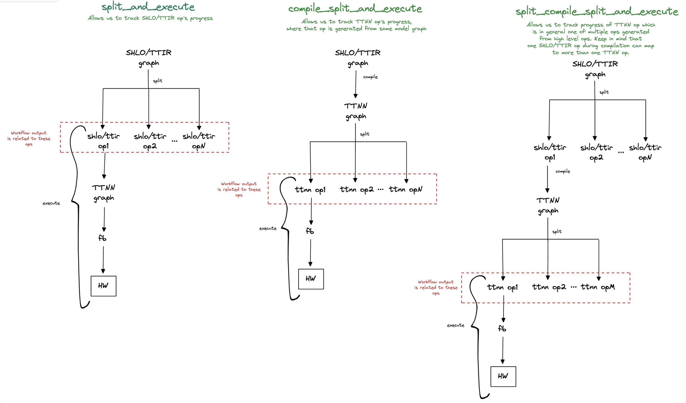

# Problem description
Frontends needed a way to analyze and report status of operations (stablehlo, ttir, ttnn) used in models they bring up. This PR implements generic infrastructure to split the model into constituent operations, compile and run them individually on our devices.

Three workflows which combine some sequence of splitting, compiling and running models (coming into infra as MLIR modules) are provided for frontends to use. With intention of keeping the API as simple as possible, they are exposed to frontends through one public function `ttmlir.workflow::run_op_by_op_workflow` whose behaviour is controlled through parameters.

Workflows return a list of OpTest pydantic models (which are intermediary objects we use in CI reporting infra, between our compiler and final DB tables) which unambiguously describe the "state" of ops found in model. These can be dumped in pytest reports in frontends, and CI workflows will pick them up and add them to Superset datasets.



# How to use workflows from frontends

- Add path to ttmlir python lib like `$(pwd)/third_party/tt-mlir/build/python_package` to `PYTHONPATH` env var so workflows can be imported like `from ttmlir.workflows import ...`
- Add path to ttrt python lib built from wheel like `$(pwd)/third_party/tt-mlir/build/runtime/tools/python/build/lib.linux-x86_64-3.11` to `PYTHONPATH`
- In a model test, separate ways for full model testing (which runs through usual frontend's mechanism) and op by op testing
- Diverge into op by op testing by doing
```python
from ttmlir.workflows import run_op_by_op_workflow

frontend = ...
model_name = ...
# ...
pydantic_reports = run_op_by_op_workflow(
    model.as_mlir_module(),  # or `model.as_mlir_module_str()`, both work
    compile_before_split=False,
    compile_each_submodule_after_split=False, # This combination of parameters targets `split_and_execute` workflow
    # Following are informations that cannot be filled in infra but have to come from frontend
    frontend=frontend,
    model_name=model_name,
)
```

- Use pytest's `record_property` fixture to dump to report (there is a json reporting extension for pytest, turned on by passing `--json-report --json-report-file=report.json` to pytest call)
